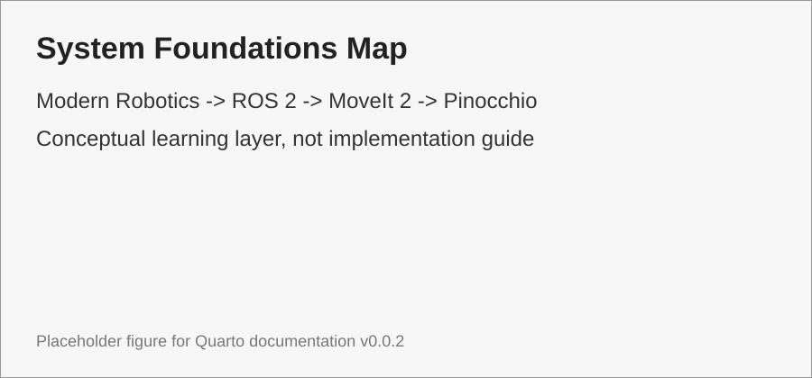

# 01. System Foundations

Trang này là entry-point cho các tài liệu nền tảng. Phạm vi hiện tại chưa đi vào hệ thống robot cụ thể, mà chỉ xây dựng **khung khái niệm** cần học.

{#fig-system-foundations-map width=90%}

Xem @fig-system-foundations-map để định vị bốn nhánh kiến thức.

```{mermaid}
flowchart LR
    MR[Modern Robotics] --> ROS[ROS 2]
    MR --> MoveIt[MoveIt 2]
    MR --> Pinocchio[Pinocchio]
    ROS --> MoveIt
    Pinocchio --> MoveIt
```

## Cấu trúc chính

| Nhánh | Vai trò | Cần ưu tiên |
|---|---|---|
| Modern Robotics | Nền toán, cơ học, kinematics, dynamics, planning, control | Cao |
| ROS 2 | Communication graph, runtime, TF, DDS, ros2_control | Trung bình |
| MoveIt 2 | Robot model, planning scene, solver, trajectory | Trung bình |
| Pinocchio | Computation model cho FK, Jacobian, dynamics | Trung bình |

::: callout-important
Trong bản `v0.0.2`, phần **Modern Robotics** là phần được viết dày nhất. Các phần còn lại là nền khái niệm để đọc tài liệu framework và source robot.
:::
