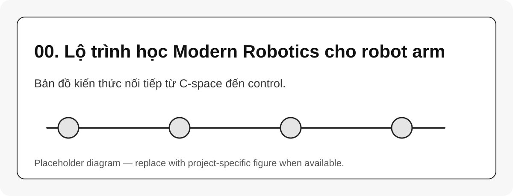

# 00. Lộ trình học Modern Robotics cho robot arm

{#fig-00-learning-roadmap width=85%}

Trang này đóng vai trò **mục lục học có thứ tự**. Khi học robotics cho robot arm, lỗi phổ biến là học thẳng IK, MoveIt 2 hoặc controller mà chưa vững ba lớp nền: **frame**, **pose transform**, và **joint-space representation**. *Modern Robotics* nên được đọc như một chuỗi khái niệm nối tiếp, không phải như một tập công thức rời rạc [@lynch2017modernrobotics].

```{mermaid}
flowchart LR
    A[Configuration Space] --> B[Rigid-Body Motion]
    B --> C[SO(3) / SE(3)]
    C --> D[Twist / Screw]
    D --> E[Forward Kinematics]
    E --> F[Jacobian]
    F --> G[Inverse Kinematics]
    F --> H[Singularity]
    C --> I[Dynamics]
    G --> J[Trajectory]
    J --> K[Motion Planning]
    I --> L[Control]
    K --> L
```

## Cách học thực dụng

Không cần đọc toàn bộ sách theo cùng độ sâu. Với robot arm, nên chia thành ba tầng:

| Tầng | Cần nắm chắc | Mục tiêu thực dụng |
|---|---|---|
| Tầng hình học | $SO(3)$, $SE(3)$, transform chain | Đọc đúng URDF/TF/Pinocchio placement |
| Tầng động học | FK, PoE, Jacobian, IK, singularity | Debug pose, solver và vùng làm việc |
| Tầng chuyển động | trajectory, planning, dynamics, control | Hiểu vì sao robot chạy giật, fail hoặc lệch |

::: callout-important
Thứ tự học khuyến nghị: đừng học IK trước FK; đừng học MoveIt trước C-space; đừng học dynamics trước khi nắm được twist/Jacobian.
:::

## Bảng học nhanh

```{python}
#| eval: false
import pandas as pd
pd.read_csv("assets/tables/modern_robotics_learning_path.csv")
```

::: callout-tip
Khi đọc source robot, mỗi hàm nên được gắn nhãn bằng một khái niệm nền: `forwardKinematics` thuộc FK, `computeFrameJacobian` thuộc Jacobian, `rnea` thuộc inverse dynamics, `FollowJointTrajectory` thuộc trajectory execution.
:::
