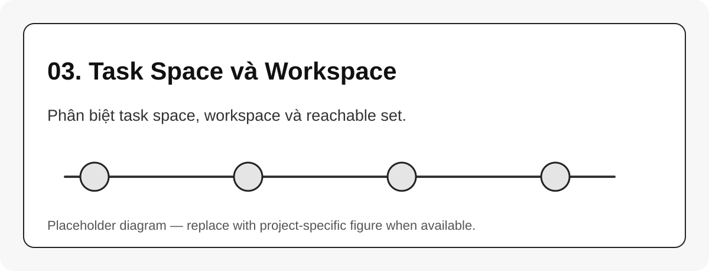

# 03. Task Space và Workspace

{#fig-03-task-space-workspace width=85%}

**Task space** là không gian mà nhiệm vụ quan tâm. Với robot arm, task space thường là pose của end-effector:

$$
X = (R,p), \quad R \in SO(3), \quad p \in \mathbb{R}^3
$$

**Workspace** là tập các pose hoặc vị trí mà end-effector có thể đạt được. Trong thực tế nên tách:

| Loại workspace | Ý nghĩa |
|---|---|
| Position workspace | chỉ xét vị trí $x,y,z$ |
| Orientation workspace | xét thêm hướng tool |
| Reachable workspace | tồn tại ít nhất một nghiệm IK |
| Dexterous workspace | có thể đạt nhiều hướng khác nhau tại cùng vị trí |
| Collision-free workspace | reach được và không va chạm |

```{mermaid}
flowchart TB
    A[Joint Space q] -->|FK| B[Task Space pose]
    B --> C[Position workspace]
    B --> D[Orientation feasibility]
    C --> E[Reachability map]
    D --> E
```

## Liên hệ với IK

IK là ánh xạ ngược từ task space về C-space:

$$
X_d \rightarrow q
$$

Nhưng ánh xạ này không đảm bảo tồn tại nghiệm, không đảm bảo nghiệm duy nhất, và không đảm bảo nghiệm an toàn.

::: callout-important
Khi benchmark robot arm, nên phân biệt rõ lỗi `không reach được` với lỗi `solver không tìm ra nghiệm`. Hai lỗi này khác nhau.
:::
