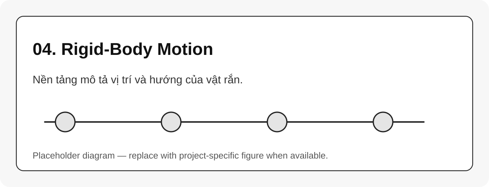

# 04. Rigid-Body Motion

{#fig-04-rigid-body-motion width=85%}

Robot arm được mô hình hóa như một chuỗi các **rigid bodies** liên kết bằng joint. Một link được xem là rigid nếu khoảng cách giữa mọi cặp điểm trên link không đổi theo thời gian. Khi đó chuyển động của link có thể mô tả bằng pose của một frame gắn cứng lên link [@lynch2017modernrobotics].

## Pose của một rigid body

Pose gồm hai phần:

$$
\text{pose} = (\text{orientation}, \text{position}) = (R,p)
$$

Trong đó $R$ mô tả hướng, $p$ mô tả vị trí.

```{mermaid}
flowchart LR
    A[Attach frame to link] --> B[Measure orientation R]
    A --> C[Measure position p]
    B --> D[Pose T]
    C --> D
```

## Vì sao phải học rigid-body motion?

| Nơi xuất hiện | Rigid-body concept tương ứng |
|---|---|
| URDF `<origin xyz rpy>` | fixed transform giữa parent và child |
| TF2 | transform giữa frame theo thời gian |
| MoveIt robot state | cấu hình robot sinh ra pose link |
| Pinocchio placement | $SE(3)$ placement của joint/frame |
| Camera extrinsic | pose camera so với robot/base |

::: callout-note
Trong robotics software, gần như mọi thứ liên quan đến vị trí/hướng đều quay về câu hỏi: frame này đang nằm ở đâu so với frame kia?
:::
