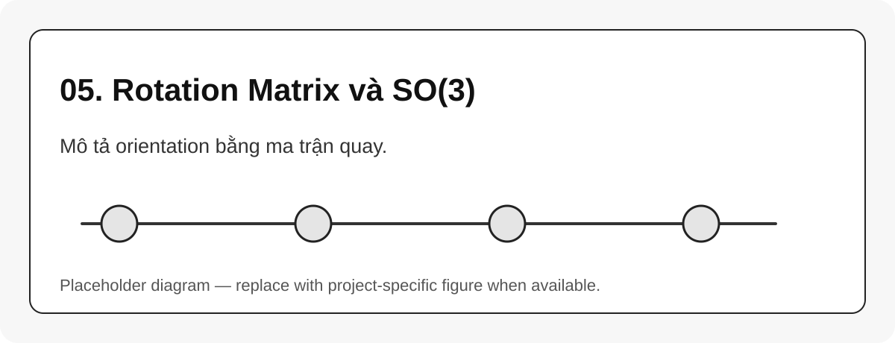

# 05. Rotation Matrix và SO(3)

{#fig-05-so3-rotation width=85%}

Ma trận quay $R$ mô tả hướng của một frame so với frame khác. Tập các ma trận quay 3D hợp lệ là nhóm $SO(3)$:

$$
SO(3) = \{R \in \mathbb{R}^{3\times 3} \mid R^TR = I, \det(R)=1\}
$$ {#eq-so3-definition}

## Cách đọc ma trận quay

Các cột của ${}^aR_b$ là trục $\hat{x}_b$, $\hat{y}_b$, $\hat{z}_b$ biểu diễn trong frame $\{a\}$:

$$
{}^aR_b = \begin{bmatrix}
| & | & | \\
{}^a\hat{x}_b & {}^a\hat{y}_b & {}^a\hat{z}_b \\
| & | & |
\end{bmatrix}
$$

## Các biểu diễn orientation thường gặp

| Biểu diễn | Ưu điểm | Rủi ro |
|---|---|---|
| Rotation matrix | không kỳ dị, trực tiếp trong $SE(3)$ | 9 số nhưng chỉ 3 DOF |
| RPY/Euler | dễ đọc bằng mắt | có singularity/gimbal lock |
| Axis-angle | gần với exponential coordinates | cần xử lý góc gần 0 |
| Quaternion | tốt cho interpolation | cần normalize, dấu kép |

::: callout-warning
RPY chỉ là cách hiển thị orientation. Không nên lấy RPY làm biểu diễn nội bộ chính cho IK hoặc pose error nếu có thể dùng $SO(3)/SE(3)$.
:::
