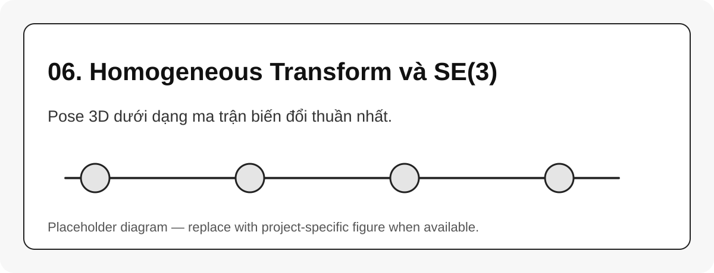

# 06. Homogeneous Transform và SE(3)

{#fig-06-se3-homogeneous-transform width=85%}

Một pose trong không gian 3D thường được viết bằng homogeneous transform:

$$
T =
\begin{bmatrix}
R & p \\
0 & 1
\end{bmatrix},
\quad R \in SO(3), \quad p \in \mathbb{R}^3, \quad T \in SE(3)
$$ {#eq-se3-transform}

## Nhân transform

Nếu biết ${}^aT_b$ và ${}^bT_c$, pose của $\{c\}$ trong $\{a\}$ là:

$$
{}^aT_c = {}^aT_b {}^bT_c
$$ {#eq-transform-chain}

Đây chính là nền của FK, TF tree, URDF chain và Pinocchio placement.

```{mermaid}
flowchart LR
    A[base] -->|T_base_link1| B[link1]
    B -->|T_link1_link2| C[link2]
    C -->|T_link2_tool| D[tool]
```

## Inverse transform

$$
T^{-1} =
\begin{bmatrix}
R^T & -R^Tp \\
0 & 1
\end{bmatrix}
$$ {#eq-se3-inverse}

::: callout-tip
Khi debug frame, hãy kiểm tra thứ tự nhân ma trận trước khi nghi ngờ solver. Rất nhiều lỗi đến từ nhân ngược chiều transform.
:::
