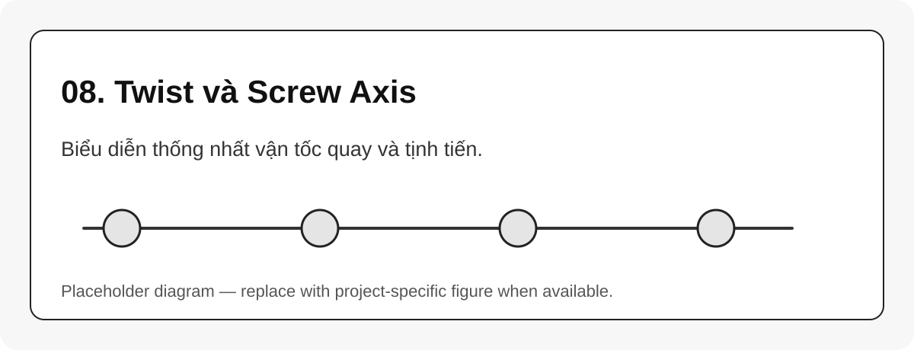

# 08. Twist và Screw Axis

{#fig-08-twist-screw-axis width=85%}

Twist là vector 6 chiều mô tả vận tốc không gian của rigid body:

$$
V =
\begin{bmatrix}
\omega \\
v
\end{bmatrix}
$$ {#eq-twist-vector}

Trong đó $\omega$ là vận tốc góc, $v$ là thành phần vận tốc tuyến tính theo convention của sách.

## Screw axis của joint quay

Với joint quay có trục đơn vị $\omega$ đi qua điểm $q_0$, screw axis là:

$$
S =
\begin{bmatrix}
\omega \\
-\omega \times q_0
\end{bmatrix}
$$ {#eq-revolute-screw-axis}

Với joint tịnh tiến theo hướng $v$:

$$
S =
\begin{bmatrix}
0 \\
v
\end{bmatrix}
$$ {#eq-prismatic-screw-axis}

```{mermaid}
flowchart LR
    A[Joint axis geometry] --> B[Screw axis S]
    B --> C[Exponential transform]
    C --> D[FK by PoE]
    B --> E[Jacobian columns]
```

::: callout-tip
Trong PoE, joint không còn là bảng D-H, mà là một trục screw có ý nghĩa hình học rõ ràng. Đây là lý do PoE rất tiện để suy luận Jacobian và IK số.
:::
