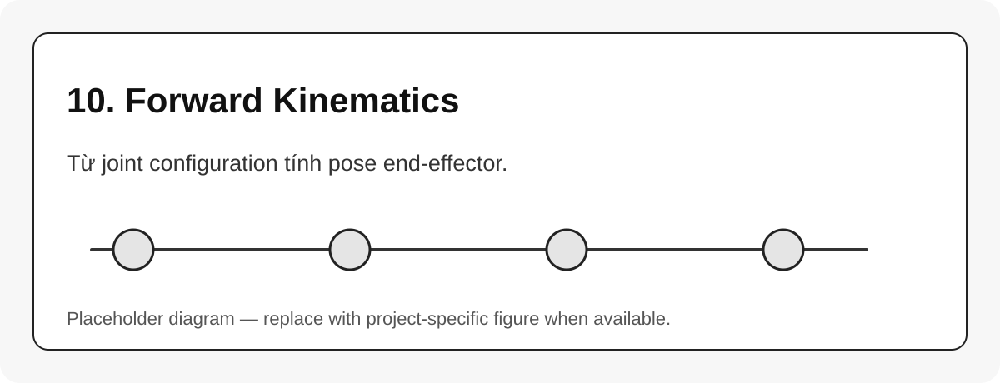

# 10. Forward Kinematics

{#fig-10-forward-kinematics-overview width=85%}

Forward kinematics, viết tắt FK, là bài toán:

$$
q \rightarrow T_{base}^{tool}(q)
$$ {#eq-fk-problem}

Với serial manipulator, FK là chuỗi nhân các transform từ base đến tool.

```{mermaid}
flowchart LR
    A[q1] --> B[T01]
    C[q2] --> D[T12]
    E[q3] --> F[T23]
    B --> G[Multiply transforms]
    D --> G
    F --> G
    G --> H[T_base_tool]
```

## Các cách viết FK

| Cách | Mô tả | Khi nào dùng |
|---|---|---|
| Transform chain | nhân từng ${}^{i-1}T_i$ | trực quan, giống URDF |
| D-H/M-DH | bảng 4 tham số/link | tính tay, paper, datasheet |
| PoE | screw axes + home pose | Jacobian/IK số, Modern Robotics |
| Library FK | Pinocchio/KDL/MoveIt | production software |

## Tư duy kiểm chứng

Nên có ít nhất hai nguồn FK độc lập: một từ URDF/library và một từ công thức tự viết. Nếu hai FK lệch nhau, kiểm tra theo thứ tự:

1. đơn vị rad/deg và m/mm;
2. zero pose;
3. joint axis;
4. thứ tự joint;
5. tool frame;
6. convention $T_{base}^{tool}$ hay $T_{tool}^{base}$.
