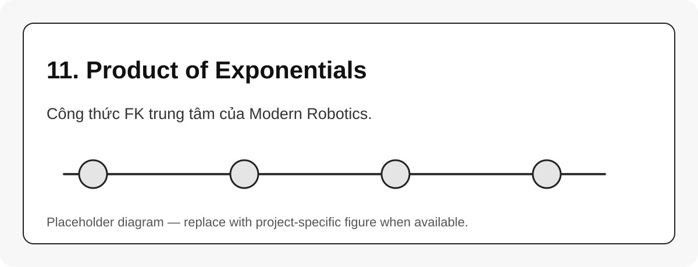

# 11. Product of Exponentials

{#fig-11-product-of-exponentials width=85%}

Product of Exponentials, PoE, mô tả FK bằng tích các exponential transform của từng joint [@lynch2017modernrobotics]. Dạng space-frame:

$$
T(\theta) = e^{[S_1]\theta_1} e^{[S_2]\theta_2} \cdots e^{[S_n]\theta_n} M
$$ {#eq-poe-space}

Trong đó:

| Ký hiệu | Ý nghĩa |
|---|---|
| $S_i$ | screw axis của joint $i$ trong base frame |
| $\theta_i$ | biến khớp |
| $M$ | pose end-effector ở home configuration |
| $T(\theta)$ | pose hiện tại của end-effector |

## Dạng body-frame

$$
T(\theta) = M e^{[B_1]\theta_1} e^{[B_2]\theta_2} \cdots e^{[B_n]\theta_n}
$$ {#eq-poe-body}

## Điểm mạnh của PoE

PoE không yêu cầu gán frame cho từng link như D-H. Ta chỉ cần base frame, home tool frame và screw axis của từng joint. Điều này rất hợp với cách nghĩ hiện đại về $SE(3)$, Jacobian và numerical IK.

::: callout-tip
Khi source robot dùng Pinocchio hoặc một thư viện dynamics, tư duy PoE vẫn hữu ích: mỗi joint sinh ra một phép biến đổi trong kinematic tree, còn Jacobian là cách gom ảnh hưởng của từng joint lên frame cần điều khiển.
:::
