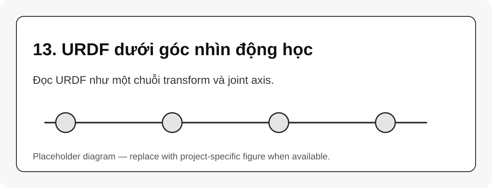

# 13. URDF dưới góc nhìn động học

{#fig-13-urdf-as-kinematic-model width=85%}

URDF không phải là D-H table. URDF mô tả robot bằng các `link`, `joint`, `origin`, `axis`, geometry và inertial. Dưới góc nhìn động học, mỗi joint tạo ra một transform từ parent link sang child link.

```xml
<joint name="joint_1" type="revolute">
  <parent link="base_link"/>
  <child link="link_1"/>
  <origin xyz="0 0 0.1" rpy="0 0 0"/>
  <axis xyz="0 0 1"/>
</joint>
```

## Mapping URDF sang toán học

| URDF field | Ý nghĩa toán học |
|---|---|
| `parent`, `child` | cạnh trong kinematic tree |
| `origin xyz rpy` | fixed transform trước joint motion |
| `axis xyz` | hướng trục joint trong joint frame |
| `limit` | miền hợp lệ của $q_i$ |
| `visual/collision` | geometry phục vụ hiển thị và collision checking |
| `inertial` | mass/inertia phục vụ dynamics |

## Tư duy đúng

```{mermaid}
flowchart LR
    A[URDF joint origin] --> B[Fixed transform]
    C[URDF joint axis] --> D[Joint motion]
    B --> E[Transform parent to child]
    D --> E
    E --> F[FK / TF / RobotState]
```

::: callout-tip
Khi một robot có camera, gripper hoặc tool offset, URDF thuận tiện hơn D-H vì có thể thêm fixed joint/frame mà không phá convention D-H.
:::
