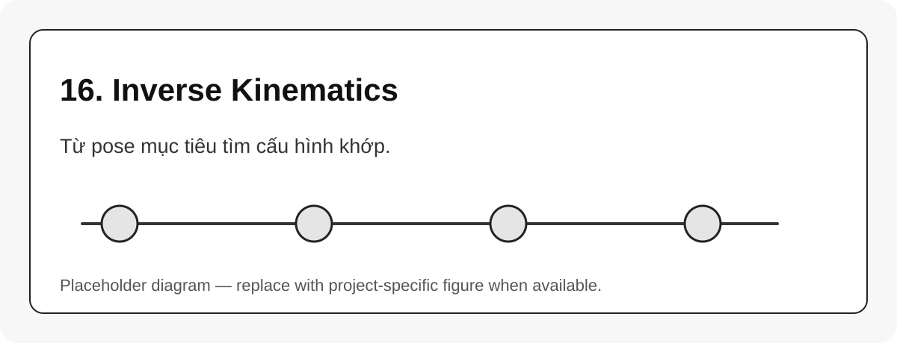

# 16. Inverse Kinematics

{#fig-16-inverse-kinematics width=85%}

Inverse kinematics, IK, là bài toán:

$$
T_d \rightarrow q
$$ {#eq-ik-problem}

Khác với FK, IK thường không có nghiệm duy nhất. Có thể có nhiều nghiệm, không có nghiệm, hoặc solver không tìm ra nghiệm dù nghiệm tồn tại.

## Các loại IK

| Loại | Đặc điểm | Khi nào phù hợp |
|---|---|---|
| Analytic IK | công thức đóng | robot 6R có cấu trúc đặc biệt |
| Numerical IK | lặp giảm lỗi pose | robot tổng quát, URDF bất kỳ |
| Differential IK | dựa trên vận tốc và Jacobian | servo/control loop |
| Constrained IK | thêm joint limit/collision/task constraint | planning thực tế |

## Những yếu tố làm IK fail

- pose ngoài workspace;
- orientation yêu cầu không khả thi;
- seed state quá xa nghiệm;
- gần singularity;
- joint limit hoặc collision;
- sai frame của target pose;
- sai tool frame hoặc base frame.

::: callout-important
IK không phải chỉ là “tính góc”. IK là bài toán số có điều kiện, cần seed, tolerance, joint limit và convention frame đúng.
:::
