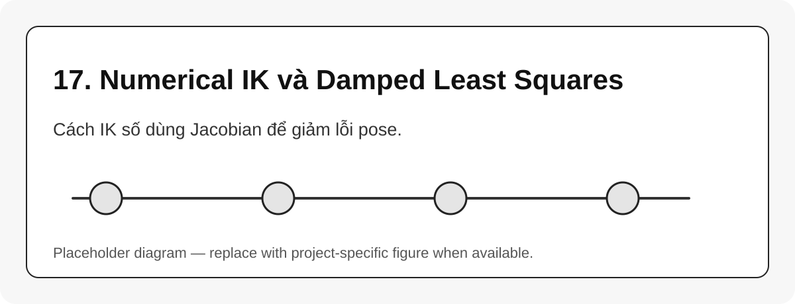

# 17. Numerical IK và Damped Least Squares

{#fig-17-numerical-ik-damped-least-squares width=85%}

Numerical IK lặp từ một cấu hình ban đầu $q_k$, tính lỗi pose $e_k$, rồi cập nhật $q$ bằng Jacobian.

Dạng pseudoinverse cơ bản:

$$
\Delta q = J^\dagger(q)e
$$ {#eq-ik-pseudoinverse}

Damped least squares, DLS, ổn định hơn gần singularity:

$$
\Delta q = J^T(JJ^T + \lambda^2I)^{-1}e
$$ {#eq-dls}

Sau đó:

$$
q_{k+1} = q_k + \alpha \Delta q
$$ {#eq-ik-update}

## Các tham số solver nên hiểu

| Tham số | Ý nghĩa |
|---|---|
| `max_iter` | số vòng lặp tối đa |
| `tolerance` | ngưỡng hội tụ của lỗi pose |
| `damping` | hệ số chống suy biến |
| `step_size` | độ lớn bước cập nhật |
| seed | nghiệm khởi tạo |

## Bài học từ source robot

Trong source `reBotArm_control_py`, các module IK/CLIK dùng Pinocchio, `log6`, DLS và joint limit handling. Điều đó cho thấy kiến thức Jacobian, $SE(3)$ log map và damping không chỉ là lý thuyết mà đi thẳng vào solver thực tế.

::: callout-warning
Tăng damping có thể làm solver ổn định hơn nhưng chậm hơn và kém chính xác hơn. Giảm damping quá thấp có thể làm nghiệm nhảy khi gần singularity.
:::
