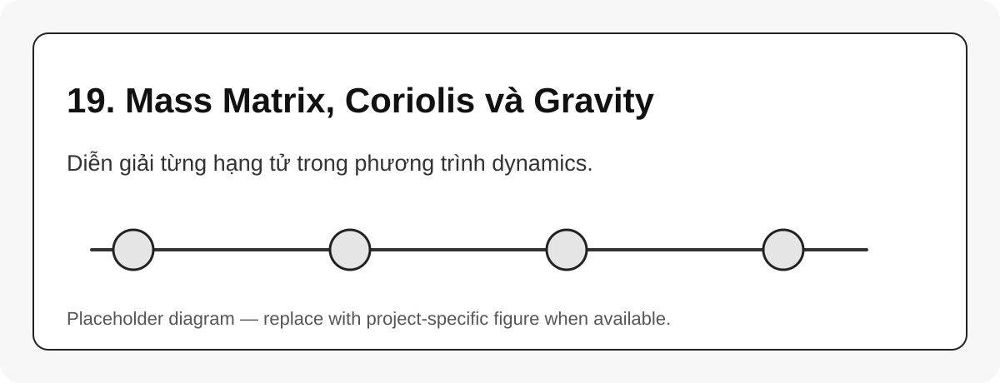

# 19. Mass Matrix, Coriolis và Gravity

{#fig-19-mass-coriolis-gravity width=85%}

Phương trình dynamics không nên học như công thức thuộc lòng. Mỗi hạng tử phản ánh một hiệu ứng vật lý.

## Mass matrix

$M(q)$ mô tả quán tính hiệu dụng của robot tại cấu hình $q$. Nó thay đổi theo tư thế robot.

## Coriolis/centrifugal terms

$C(q,\dot{q})\dot{q}$ xuất hiện khi robot chuyển động nhanh và nhiều khớp tương tác động học.

## Gravity term

$g(q)$ là torque cần để chống trọng lực tại cấu hình $q$ khi $\dot{q}=0$, $\ddot{q}=0$.

$$
\tau_{gravity} = g(q)
$$ {#eq-gravity-compensation}

## Bảng hiểu nhanh

| Trường hợp | Hạng tử nổi bật |
|---|---|
| đứng yên giữ pose | $g(q)$ |
| tăng tốc nhanh | $M(q)\ddot{q}$ |
| chuyển động nhanh nhiều khớp | $C(q,\dot{q})\dot{q}$ |
| mang tải | cần thêm payload/external wrench |

::: callout-tip
Nếu robot position-control bị yếu ở một số pose, hãy nghĩ đến moment do trọng lực và cánh tay đòn trước khi nghi ngờ IK.
:::
