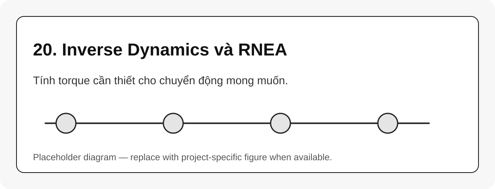

# 20. Inverse Dynamics và RNEA

{#fig-20-inverse-dynamics-rnea width=85%}

Inverse dynamics nhận $q$, $\dot{q}$, $\ddot{q}$ và trả về torque cần thiết:

$$
(q,\dot{q},\ddot{q}) \rightarrow \tau
$$ {#eq-inverse-dynamics-map}

Recursive Newton-Euler Algorithm, RNEA, là thuật toán hiệu quả cho inverse dynamics của open-chain robot [@lynch2017modernrobotics].

## Hai pass trực quan

```{mermaid}
flowchart LR
    A[Base to tool] --> B[Propagate velocity/acceleration]
    B --> C[Compute link inertial wrench]
    C --> D[Tool to base]
    D --> E[Accumulate forces and torques]
    E --> F[joint torque tau]
```

## Vì sao cần biết RNEA?

Trong thư viện như Pinocchio, `rnea` thường là hàm trung tâm để tính inverse dynamics. Source `reBotArm_control_py` cũng có module inverse dynamics gọi RNEA, minh họa trực tiếp mối nối giữa lý thuyết Modern Robotics và code robot.

::: callout-note
Nếu chưa làm torque control, vẫn nên hiểu RNEA ở mức khái niệm để đọc được các hàm dynamics trong Pinocchio.
:::
