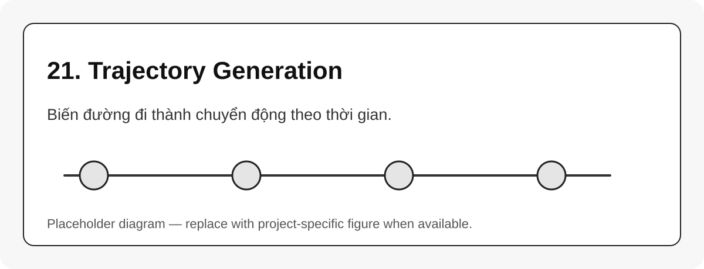

# 21. Trajectory Generation

{#fig-21-trajectory-generation width=85%}

**Path** là mô tả hình học của đường đi. **Trajectory** là path cộng với time scaling.

$$
\text{trajectory} = \text{path} + \text{time scaling}
$$

## Joint-space trajectory

Robot đi từ $q_{start}$ đến $q_{goal}$ trong joint space. Đây thường là dạng an toàn và phổ biến cho execution.

## Task-space trajectory

Robot đi theo đường trong không gian tool, ví dụ đường thẳng Cartesian. Dạng này cần IK liên tục hoặc differential IK.

```{mermaid}
flowchart LR
    A[Waypoints] --> B[Interpolation]
    B --> C[Time scaling]
    C --> D[JointTrajectory]
    D --> E[Controller]
```

## Các giới hạn cần tôn trọng

| Giới hạn | Vì sao quan trọng |
|---|---|
| position limit | tránh vượt joint range |
| velocity limit | tránh giật và mất bước |
| acceleration limit | tránh rung/lực quán tính lớn |
| jerk limit | giúp chuyển động mượt hơn |

::: callout-warning
Một chuỗi waypoint hợp lệ chưa chắc là trajectory tốt. Nếu time scaling xấu, robot vẫn có thể chạy giật hoặc vượt giới hạn vận tốc.
:::
