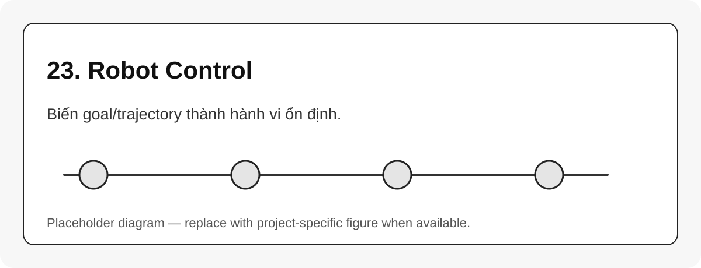

# 23. Robot Control

{#fig-23-robot-control width=85%}

Robot control là lớp biến mục tiêu chuyển động thành input cho actuator. *Modern Robotics* phân biệt motion control, force control, hybrid motion-force control và impedance control [@lynch2017modernrobotics].

## Các kiểu control chính

| Kiểu control | Input/goal | Khi nào dùng |
|---|---|---|
| Position control | vị trí khớp hoặc pose | robot giáo dục/industrial cơ bản |
| Velocity control | vận tốc khớp hoặc twist | servo, teleop, tracking |
| Torque control | torque joint | robot có model và actuator phù hợp |
| Force control | wrench | tiếp xúc với môi trường |
| Impedance control | quan hệ lực-chuyển động | interaction an toàn/mềm |

## Control loop cơ bản

```{mermaid}
flowchart LR
    A[Desired trajectory] --> B[Controller]
    C[Measured state] --> B
    B --> D[Command]
    D --> E[Robot hardware]
    E --> C
```

::: callout-important
Control không thể sửa mọi lỗi mô hình. Nếu FK/URDF/frame sai, controller có thể chạy ổn về mặt số nhưng robot vẫn đi sai ngoài đời.
:::
