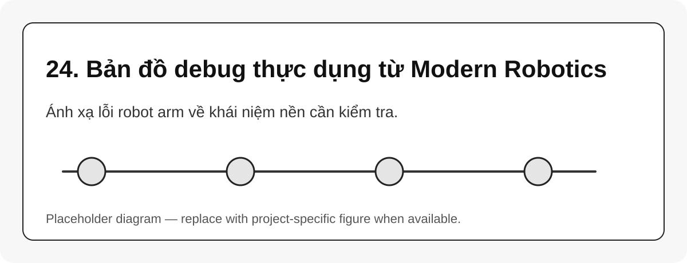

# 24. Bản đồ debug thực dụng từ Modern Robotics

{#fig-24-practical-debugging-map width=85%}

Trang này gom các lỗi thực dụng và ánh xạ về phần Modern Robotics cần dùng để phân tích.

| Triệu chứng | Kiến thức cần kiểm tra | Câu hỏi debug |
|---|---|---|
| FK sai với RViz | $SE(3)$, transform chain, URDF | frame parent/child có đúng không? |
| IK không hội tụ | Jacobian, pose error, DLS | seed và frame lỗi có đúng convention không? |
| Robot gần pose nào đó bị giật | singularity, manipulability | condition number của $J$ có lớn không? |
| Joint chạy nhiều dù tool đi ít | redundancy, null-space | solver chọn nghiệm có hợp lý không? |
| Plan được nhưng execution xấu | trajectory, time scaling, limits | velocity/acceleration có thực tế không? |
| Giữ pose yếu khi vươn xa | dynamics, gravity torque | moment do trọng lực có vượt khả năng không? |

```{mermaid}
flowchart TB
    A[Observed robot issue] --> B{Pose math issue?}
    B -->|yes| C[Check SO(3)/SE(3)/FK]
    B -->|no| D{Solver issue?}
    D -->|yes| E[Check Jacobian/IK/singularity]
    D -->|no| F{Motion issue?}
    F -->|yes| G[Check trajectory/planning/control]
    F -->|no| H[Check hardware/API/feedback]
```

::: callout-tip
Một benchmark tốt nên ghi lại: $q$, target pose, FK pose, IK error, Jacobian condition number, joint limits margin, command timestamp và feedback timestamp.
:::
