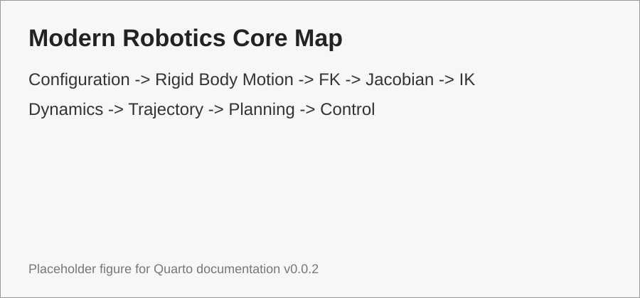

# Modern Robotics Core

Phần này chắt lọc các kiến thức cần học từ *Modern Robotics* [@lynch2017modernrobotics]. Trọng tâm là học vững nền toán và cơ học robot để sau này đọc ROS 2, MoveIt 2, Pinocchio, URDF và source robot không bị rời rạc.

{#fig-modern-robotics-core-map width=90%}

```{mermaid}
flowchart TB
    A[00 Roadmap] --> B[01 Notation]
    B --> C[02 C-space]
    C --> D[04 Rigid-body Motion]
    D --> E[05 SO(3)]
    E --> F[06 SE(3)]
    F --> G[07 Exponential Coordinates]
    G --> H[08 Twist / Screw]
    H --> I[10 FK]
    I --> J[11 PoE]
    J --> K[14 Jacobian]
    K --> L[16 IK]
    K --> M[15 Singularity]
    F --> N[18 Dynamics]
    L --> O[21 Trajectory]
    O --> P[22 Motion Planning]
    N --> Q[23 Control]
    P --> Q
```

## Danh sách bài học theo số thứ tự

- [00. Lộ trình học Modern Robotics cho robot arm](00-learning-roadmap/index.qmd)
- [01. Quy ước ký hiệu, đơn vị và frame](01-notation-units-conventions/index.qmd)
- [02. Configuration Space](02-configuration-space/index.qmd)
- [03. Task Space và Workspace](03-task-space-workspace/index.qmd)
- [04. Rigid-Body Motion](04-rigid-body-motion/index.qmd)
- [05. Rotation Matrix và SO(3)](05-so3-rotation/index.qmd)
- [06. Homogeneous Transform và SE(3)](06-se3-homogeneous-transform/index.qmd)
- [07. Exponential Coordinates và Lie Algebra](07-exponential-coordinates-lie-algebra/index.qmd)
- [08. Twist và Screw Axis](08-twist-screw-axis/index.qmd)
- [09. Wrench, Spatial Force và Statics](09-wrench-spatial-force-statics/index.qmd)
- [10. Forward Kinematics](10-forward-kinematics-overview/index.qmd)
- [11. Product of Exponentials](11-product-of-exponentials/index.qmd)
- [12. D-H, M-DH, PoE và URDF](12-dh-mdh-poe-urdf-comparison/index.qmd)
- [13. URDF dưới góc nhìn động học](13-urdf-as-kinematic-model/index.qmd)
- [14. Jacobian và Velocity Kinematics](14-jacobian-velocity-kinematics/index.qmd)
- [15. Singularity và Manipulability](15-singularity-manipulability/index.qmd)
- [16. Inverse Kinematics](16-inverse-kinematics/index.qmd)
- [17. Numerical IK và Damped Least Squares](17-numerical-ik-damped-least-squares/index.qmd)
- [18. Dynamics of Open Chains](18-dynamics-open-chain-overview/index.qmd)
- [19. Mass Matrix, Coriolis và Gravity](19-mass-coriolis-gravity/index.qmd)
- [20. Inverse Dynamics và RNEA](20-inverse-dynamics-rnea/index.qmd)
- [21. Trajectory Generation](21-trajectory-generation/index.qmd)
- [22. Motion Planning trong C-space](22-motion-planning-cspace/index.qmd)
- [23. Robot Control](23-robot-control/index.qmd)
- [24. Bản đồ debug thực dụng từ Modern Robotics](24-practical-debugging-map/index.qmd)

## Nguyên tắc học

| Nguyên tắc | Diễn giải |
|---|---|
| Học frame trước solver | Solver IK/MoveIt/Pinocchio đều dựa trên frame và transform đúng |
| FK trước IK | Không thể debug IK nếu chưa tự kiểm tra được FK |
| Jacobian là cầu nối | Jacobian nối FK, IK, singularity, velocity control và statics |
| Dynamics học vừa đủ | Chưa cần torque control vẫn cần hiểu gravity, inertia và limits |
| Trajectory khác path | Path hợp lệ chưa đủ; trajectory phải có thời gian và giới hạn động học |

::: callout-note
Bản v0.0.3 đã đổi toàn bộ topic Modern Robotics sang thư mục có số thứ tự để dễ đọc nối tiếp và dễ mở rộng về sau.
:::
