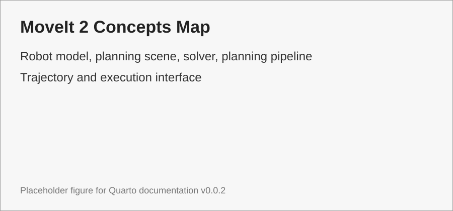

# MoveIt 2 Concepts

MoveIt 2 là manipulation planning framework. Nó không phải low-level motor driver, mà là lớp robot model, planning scene, solver và trajectory pipeline [@moveit2docs].

{#fig-moveit2-concepts-map width=90%}

```{mermaid}
flowchart LR
    A[Goal] --> B[Robot Model]
    C[Planning Scene] --> D[Planning Pipeline]
    B --> D
    D --> E[Robot Trajectory]
    E --> F[Execution Interface]
```
