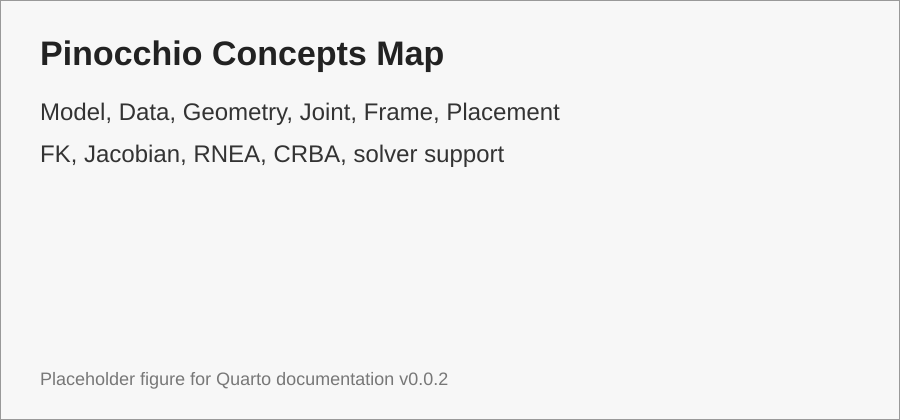

# Pinocchio Concepts

Pinocchio là thư viện rigid body dynamics hiệu năng cao, thường dùng để tính FK, Jacobian, inverse dynamics, mass matrix và các đạo hàm liên quan [@carpentier2019pinocchio].

{#fig-pinocchio-concepts-map width=90%}

```{mermaid}
flowchart LR
    A[URDF] --> B[Model]
    B --> C[Data]
    C --> D[FK / Jacobian / Dynamics]
    D --> E[Solver or Controller Computation]
```
