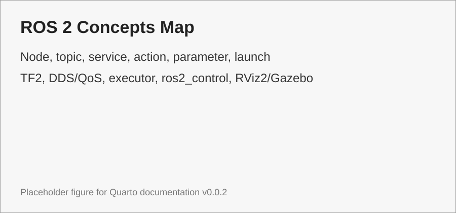

# ROS 2 Concepts

ROS 2 được xem như middleware và runtime communication model cho robot software [@rico2025ros2; @ros2docs]. Phần này chỉ giải thích concept.

{#fig-ros2-concepts-map width=90%}

```{mermaid}
flowchart TB
    A[ROS 2] --> B[Node]
    A --> C[Topic / Message]
    A --> D[Service]
    A --> E[Action]
    A --> F[Parameter / Launch]
    A --> G[TF2]
    A --> H[DDS / QoS]
    A --> I[Executor / Callback]
    A --> J[ros2_control]
    A --> K[RViz2 / Gazebo]
```
