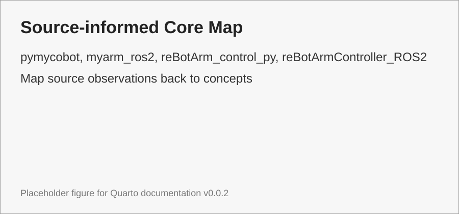

# Source-informed Core Map

Trang này không phân tích sâu từng repo, mà rút ra **những khái niệm system foundations cần học** từ source robot.

{#fig-source-map width=90%}

```{mermaid}
flowchart TB
    A[pymycobot] --> B[Hardware API boundary]
    C[myarm_ros2] --> D[ROS 2 nodes, topics, services, URDF]
    E[reBotArm_control_py] --> F[Pinocchio FK, IK, dynamics, trajectory]
    G[reBotArmController_ROS2] --> H[MoveIt 2 config, actions, services, ros2_control]
    B --> I[System Foundations]
    D --> I
    F --> I
    H --> I
```

## Nguồn đã dùng để định hướng nội dung

| Source | Điều quan sát được | Khái niệm cần học |
|---|---|---|
| `pymycobot` | hardware SDK/serial API, lệnh angle/coord | API boundary, unit conversion, command semantics |
| `myarm_ros2` | ROS 2 node, service, topic, URDF/RViz config | node, topic, service, TF/URDF, JointState |
| `reBotArm_control_py` | Pinocchio FK/IK/dynamics/trajectory | FK, IK, DLS, Jacobian, RNEA, CRBA |
| `reBotArmController_ROS2` | MoveIt config, action/msg/service, bringup | planning scene, solver, trajectory, ros2_control |

::: callout-note
Các quan sát này chỉ dùng để chọn nội dung học. Phần này chưa phải tài liệu implementation cho robot cụ thể.
:::
