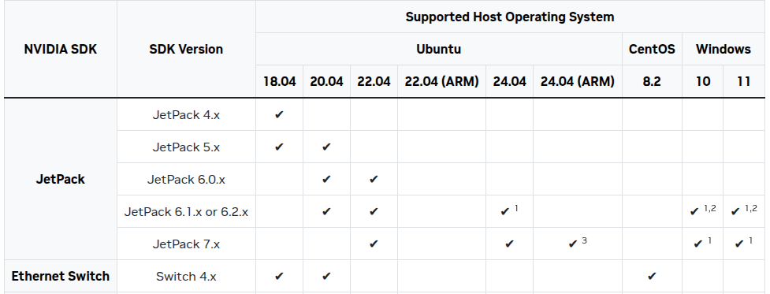
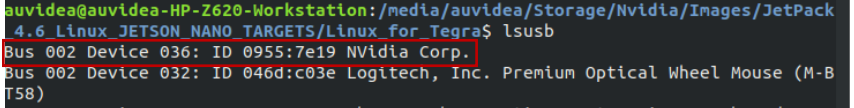
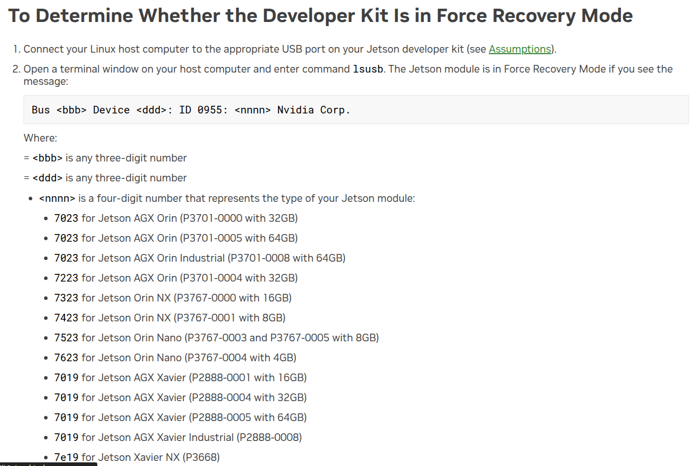
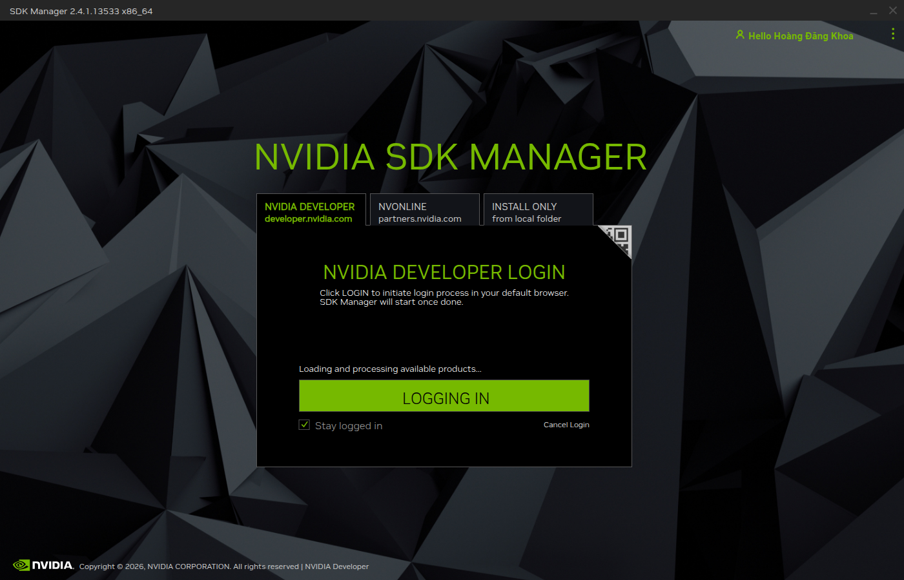
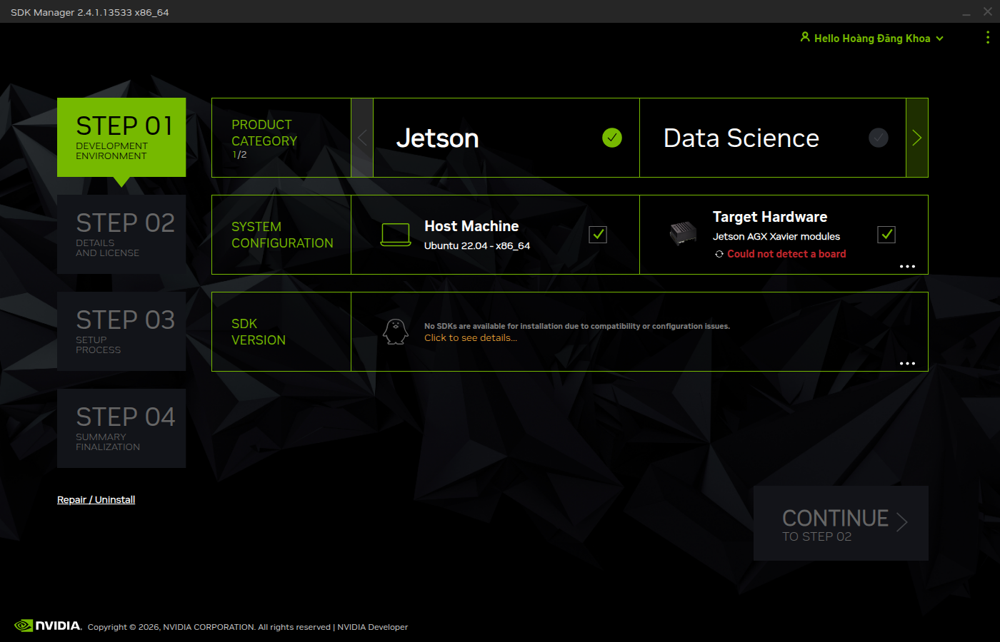

## Phần cứng cần chuẩn bị
- [Jetson AGX Xavier module](https://developer.nvidia.com/embedded/jetson-agx-xavier-developer-kit) (P2888-0004 hoặc P2888-0008)
- [Custom carrier board Auvidea X221-AI](https://auvidea.eu/products/x221-ai/)
- [SSD NVMe](https://www.samsung.com/semiconductor/minisite/ssd/product/consumer/) (đọc thêm lưu ý về thông số của NVMe (gen 3 hoặc gen 4. pcle x4) trong tài liệu của Auvidea)
- USB-A to micro USB cable cái nào xịn xịn tí là ok USB2.0 là được.
- Một máy tính ngoài chạy Ubuntu bản 20.04 (này là yêu cầu bắt buộc cuẩ NVIDIA) đọc thêm matrix tương thích phần cứng và phần mềm của NVIDIA Jetson tại đây [NVIDIA Jetson Linux Developer Guide](https://developer.nvidia.com/sdk-manager) để tránh lỗi không tương thích khi flash.
- Một số phụ kiện khác như cáp HDMI, chuột, bàn phím để kiểm tra sau khi flash nếu cần thiết.


## Tóm tắt cấu hình đang dùng

Ở đây mình chỉ tóm tắt cấu hình mà minh đang sử dụng trong dự án này các bạn có thể coi thêm phần các thông tin cụ thể trong mục [reference](../../04-reference/index.qmd).


| Thành phần | Giá trị | Ghi chú |
|---|---|---|
| Jetson module | P2888-0004 / AGX Xavier 32GB | dùng bản firmware và device tree của base 2 bản 0001 và 0004 sử dụng chung bản 0008 mới dành cho industrial.  |
| Carrier board | Auvidea X221-AI | có BSP/firmware riêng bạn tìm tại đây [Auvidea firmware](https://auvidea.eu/firmware/) |
| Firmware vendor | AGX Xavier JP 5.1.2 v2 | gói Auvidea mới nhất cho X221 đã kiểm tra và tải [firmware X221](https://f000.backblazeb2.com/file/auvidea-download/images/Jetpack_5_1_2/AGX_Xavier_JP_5_1_2_v2.tar.xz) từ nhà sản xuất|
| Runtime hiện tại | JetPack 5.1.6 | Vẫn có thể cài được nhưng đang test (Đây là bản mới nhấy maxping dành cho AGX Xavier) |
| Rootfs | NVMe | eMMC vẫn giữ boot components bắt buộc để boot rồi mới đến NVMe hãy coi đọc thêm lưu ý ở tài liệu của Nvidia |


::: callout-warning

- `P2888-0004` dùng `auvidea-agx-xavier-base`.
- Chỉ dùng `auvidea-agx-xavier-industrial` nếu module là bản Industrial bản (P2888-0008).
- Nếu gặp `bct_mb1 failed verify code 24`, ưu tiên kiểm tra sai board config, sai module SKU hoặc trộn BSP không tương thích hoặc sai cấu hình external và internal, củng có thể đến từ device chưa vào Recovery Mode.

:::


## Tải và cài đặt Nvidia SDK Manager trên máy tính host Ubuntu 20.04

Hãy đọc thêm tại [Nvidia SDK Manager](https://developer.nvidia.com/sdk-manager) để tải và cài đặt SDK Manager trên máy tính host Ubuntu 20.04. Đây là công cụ chính thức của NVIDIA để flash Jetson module và cài đặt các gói phần mềm đi kèm. Xem hình @nvidia-sdk-jetpack-host-compability-matrix. để biết thêm thông tin về các phiên bản Ubuntu host được hỗ trợ.

::: callout-warning

- SDK Manager chỉ phục flash các module Jetson với Carrier Board và Development Kit chính hãng. Những custom carrier board như Auvidea X221-AI thì không được hỗ trợ chính thức. Vì vậy, bạn cần tải firmware và BSP từ nhà sản xuất Auvidea và sử dụng các script flash của NVIDIA để flash module.

:::

{#nvidia-sdk-jetpack-host-compability-matrix width=100%}

Chả hiểu tại sao bên Nvidia không cung cấp bản cài đăt .deb nên phai cài đặt và tải qua mạng network bằng terminal (Crtl + Alt + T).

Tải keyring từ trên mạng để cho apt-get update có thể thay bằng các phiên bản Ubuntu khác như `ubuntu2404`, `ubuntu2204`, `ubuntu2004`, `ubuntu1804`:

```bash
wget https://developer.download.nvidia.com/compute/cuda/repos/ubuntu2004/x86_64/cuda-keyring_1.1-1_all.deb
```

Tiếp tục sử dụng lệnh tải package để tải phần kering

```bash
sudo dpkg -i cuda-keyring_1.1-1_all.deb
```

Rồi update và tải với apt hoặc apt-get
```bash
sudo apt-get update
sudo apt-get -y install sdkmanager
```

Chạy phần mềm SDK Manager bằng lệnh sau:
```bash
sdkmanager
```

## Cách đưa Jetson AGX Xavier vào Recovery Mode

Theo tài liệu của [Auvidea Quick Start Jetson AGX Xavier - Advance flashing guide](https://auvidea.eu/download/QuickStart.pdf)
Để đưa Jetson AGX Xavier vào Recovery Mode, bạn cần thực hiện các bước sau:

- Tắt nguồn Jetson AGX Xavier nếu nó đang bật.
- Kết nối cáp USB từ máy tính host đến cổng micro USB trên Jetson
- Nhấn và giữ nút Recovery trên Jetson AGX Xavier (thường là nút nhỏ nằm gần cổng USB hoặc trên board) trong khi bạn nhấn nút Power để bật nguồn hoặc gắm nguồn lại
- Giữ nút Recovery khoảng 10 đến 15 giây

::: callout-tip
Bằng một cách nào đó thì bên Auvidea thì họ cũng bảo rằng board thiết kế  của họ cho phép vào recovery mode chỉ bằng cách tắt máy và gắn usb vào máy host rồi bật máy lại thì máy auto về recovery mode. Này đọc được trong tài liệu của board [Auvidea X221 Carrier Jetson AGX Xavier Manual](https://auvidea.eu/download/X221_Manual_v2.0.pdf) ở phần QA, nhưng mà cứ nhất luôn nút force recovery cho nó có niềm tin.
:::

- Sau đó, bạn có thể thả nút Recovery và kiểm tra xem máy tính host đã nhận diện thiết bị Jetson AGX Xavier ở chế độ Recovery chưa bằng lệnh `lsusb` trên terminal của máy tính host.

{#lsusb-conect-jetson-at-recovery-mode width=80%}

{#determine-jetson-developer-kit width=80%}

:::callout-note
Nếu bạn không thấy thiết bị Jetson AGX Xavier xuất hiện trong danh sách `lsusb` thì nó là dạng id 0955:7019 nhé
:::


## Tải JetPack 5.1.6 từ SDK Manager

Đăng nhập với tài khoản NVIDIA Developer của bạn trong SDK Manager

{#logging-nvidia-developer-account width=80%}

Giao diện ban đầu và các bạn sẽ thấy như sau

{#step01-configuration-nvidia-sdk-manager width=80%}

::: callout-note
- Product category các bạn chọn `Jetson`.
- System configuration các bạn chọn Target Hardware `Jetson AGX Xavier` và Host Machine cần là `Ubuntu 20.04`.
- SDK Version các bạn chọn `JetPack 5.1.6` (đây là bản mới nhất dành cho AGX Xavier tính đến thời điểm hiện tại).
:::

::: callout-warning
- Không chọn DeepStream nếu ứng dụng của bạn không cần đến nó vì nó sẽ chiếm nhiều dung lượng và thời gian cài đặt. Framework này chủ yếu dùng cho các ứng dụng về video analytics và AI inference trên video stream, nhiều camera,...
:::


## Khoa đang cập nhật đến đây ...


## Patch firmware Auvidea vào Linux_for_Tegra

```bash
cd <Linux_for_Tegra>
rsync -avHAX <path_to_kernel_out>/ ./
sudo ./apply_binaries.sh
ls *.conf | grep -Ei 'auvidea|xavier|industrial|p2888'
```

## Flash eMMC test trước

```bash
sudo ./flash.sh auvidea-agx-xavier-base mmcblk0p1 2>&1 | tee flash_emmc.log
```

## Flash rootfs sang NVMe

```bash
sudo ./tools/kernel_flash/l4t_initrd_flash.sh   --external-device nvme0n1p1   -c tools/kernel_flash/flash_l4t_external.xml   -S 100GiB   --showlogs   --network usb0   auvidea-agx-xavier-base internal   2>&1 | tee flash_nvme.log
```

## Kiểm tra sau boot

```bash
findmnt /
df -h /
cat /proc/cmdline | tr ' ' '
' | grep -E '^root=|rootwait'
lsblk -o NAME,PATH,SIZE,FSTYPE,MOUNTPOINT
cat /etc/nv_tegra_release
```

## Lỗi thường gặp

| Lỗi | Ý nghĩa khả dĩ | Cách xử lý |
|---|---|---|
| `bct_mb1 failed verify code 24` | sai board config/module SKU/BCT | dùng `auvidea-agx-xavier-base` cho P2888-0004 |
| `bootloader/signed/flash.idx is not found` | lỗi dây chuyền sau generate/sign fail | xem 80 dòng trước lỗi |
| APP NVMe chỉ 30GB | partition chưa mở rộng | `growpart` + `resize2fs` |
| boot vào eMMC | boot order/rootdev chưa đúng | kiểm tra UEFI/`efibootmgr` |


## Tài liệu và nguồn tham khảo

- [NVIDIA JetPack 5.1.6 SDK](https://developer.nvidia.com/embedded/jetpack-sdk-516)
- [NVIDIA Jetson Linux Developer Guide](https://docs.nvidia.com/jetson/)
- [NVIDIA Flashing Support](https://docs.nvidia.com/jetson/archives/r35.4.1/DeveloperGuide/text/SD/FlashingSupport.html)
- [NVIDIA SDK Manager](https://developer.nvidia.com/sdk-manager)
- [Auvidea firmware](https://auvidea.eu/firmware/)
- [Auvidea Software Setup Guide `QuickStart.pdf`](https://auvidea.eu/download/QuickStart.pdf)
- [Auvidea X221 Carrier Jetson AGX Xavier Manual](https://auvidea.eu/download/X221_Manual_v2.0.pdf)
- [Auvidea X221-AI Jetson AGX Xavier Product Page](https://auvidea.eu/product/x221-70881/)
- [Auvidea X221-AI Jetson AGX Xavier Product Brief](https://auvidea.eu/download/D70881.pdf)
    