## Thống nhất và chuyển đổi đơn vị
$$
q_i[\mathrm{rad}] = \frac{\pi}{180}q_i[^\circ],
\qquad
x[\mathrm{m}] = 10^{-3}x[\mathrm{mm}]
$$ {#eq-unit-conversion-v3}


## Spec phần cứng trong docs


| Nhóm | Giá trị chuẩn hóa | Ghi chú kỹ thuật |
| --- | --- | --- |
| DOF | $6+1$ joint | 6 joint arm chính + 1 joint/gripper phụ theo docs. |
| Reach ngang | $0.750~\mathrm{m}$<br>$750~\mathrm{mm}$ | Reach danh nghĩa, không tự chứng minh toàn bộ orientation reachable. |
| Span tổng | $1.500~\mathrm{m}$<br>$1500~\mathrm{mm}$ | Gần bằng 2 lần reach ngang. |
| Self-weight | $3.2~\mathrm{kg}$ | Theo docs zip. |
| Nguồn | $24~\mathrm{V},\;9.2~\mathrm{A}$ | Nguồn DC danh nghĩa trong docs product parameters. |
| Repeatability | $[-0.001, 0.001]~\mathrm{m}$<br>$[-1, 1]~\mathrm{mm}$ | Giá trị này phản ánh khả năng lặp lại một vị trí trong điều kiện tương tự |
| Accuracy | $[0.005, 0.008]~\mathrm{m}$<br>$[5, 8]~\mathrm{mm}$ |  Phản ánh sai khác tuyệt đối  |
| Payload rated | $0.5~\mathrm{kg}$<br>$500~\mathrm{g}$ | Sức nâng, chịu tải hiệu dung, trung bình|
| Payload peak | $1.0~\mathrm{kg}$<br>$1000~\mathrm{g}$ | Chịu tải lớn nhất trong 1 thời gian ngắn |
| Servo count | $8$ servo | Nhiều hơn 6 joint arm vì gồm tool/gripper/extra servo. |
| Communication frame rate | $>50~\mathrm{Hz}$ | Frame rate giao tiếp công bố, không phải closed-loop frequency. |

_Dữ liệu nguồn: `assets/tables/hardware_spec_summary.csv`._

## Mạch điện, I/O, và các cụm xử lý chuyên biệt

Docs base interface ghi có Type-C, screen, phím A/B/C, power switch, DC/IO, emergency stop, 6 input và 6 output. Input được ghi là **NPN**, output là **PNP**. Base có các đường `IN1` đến `IN6`, `OUT1` đến `OUT6`, `24V`, `GND` và emergency-stop interface.

End-effector side có Atom, LED/button, tool IO, Grove interface, Type-C và servo interface. Các chân end IO trong docs gồm `5V0`, `GND`, `3V3`, `G22`, `G19`, `G23`, `G33`.

```{mermaid}
flowchart LR
    PC[PC / Jetson] -->|USB Type-C / serial| BASIC[Basic / Screen / Transponder]
    BASIC --> PICO[Pico / Master Control]
    PICO --> SERVO[8 digital servos]
    BASIC --> ATOM[Atom / Tool end]
    ATOM --> TOOL[LED / button / tool IO / gripper interface]
```

## Mô hình động học MDH


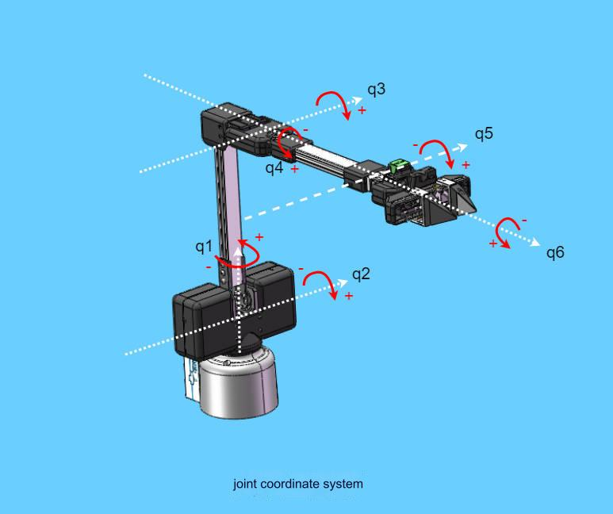{#fig-m750-joint-label-spec}

Joint arm chính được ký hiệu:

$$
q = [q_1,q_2,q_3,q_4,q_5,q_6]^\top \in \mathbb{R}^6
$$ {#eq-q-arm-vector}

Nếu source nhắc joint/gripper phụ, tài liệu ký hiệu là $q_7$. Tuy nhiên trong URDF demo, gripper không phải revolute $q_7$ mà là hai prismatic joints `gripper` và `gripper_r`.

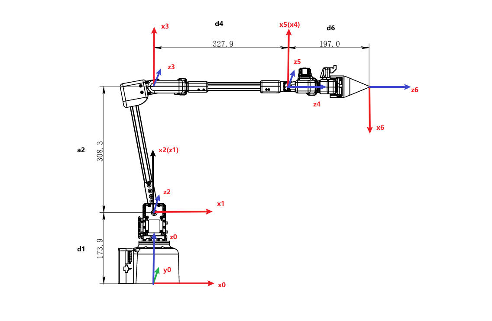{#fig-m750-dh-model-parameters}

Nhà sản xuất công bố bảng Modified Denavit–Hartenberg dành cho 6 joint arm chính. Đặt $\Delta_i$ là offset được docs ghi trong cột offset. Với modified DH, một cách viết phù hợp là:

$$
{}^{i-1}T_i(q_i) = R_x(\alpha_{i-1})T_x(a_{i-1})R_z(q_i+\Delta_i)T_z(d_i)
$$ {#eq-mdh-transform-v3}

Trong đó:

$$
R_x(\alpha)=
\begin{bmatrix}
1&0&0&0\\
0&\cos\alpha&-\sin\alpha&0\\
0&\sin\alpha&\cos\alpha&0\\
0&0&0&1
\end{bmatrix},
\quad
R_z(\theta)=
\begin{bmatrix}
\cos\theta&-\sin\theta&0&0\\
\sin\theta&\cos\theta&0&0\\
0&0&1&0\\
0&0&0&1
\end{bmatrix}
$$ {#eq-rot-blocks-v3}

$$
T_x(a)=
\begin{bmatrix}
1&0&0&a\\
0&1&0&0\\
0&0&1&0\\
0&0&0&1
\end{bmatrix},
\quad
T_z(d)=
\begin{bmatrix}
1&0&0&0\\
0&1&0&0\\
0&0&1&d\\
0&0&0&1
\end{bmatrix}
$$ {#eq-trans-blocks-v3}

| Joint | $\alpha_{i-1}$ | $a_{i-1}$ | $d_i$ | $\theta$ | $\Delta_i$ |
| --- | --- | --- | --- | --- | --- |
| $q_1$ | $0.000~\mathrm{rad}$<br>$0~^\circ$ | $0.000~\mathrm{m}$<br>$0~\mathrm{mm}$ | $0.174~\mathrm{m}$<br>$173.9~\mathrm{mm}$ | $\theta_1$ | $0.000~\mathrm{rad}$<br>$0~^\circ$ |
| $q_2$ | $-1.571~\mathrm{rad}$<br>$-90~^\circ$ | $0.000~\mathrm{m}$<br>$0~\mathrm{mm}$ | $0.000~\mathrm{m}$<br>$0~\mathrm{mm}$ | $\theta_2$ | $-1.571~\mathrm{rad}$<br>$-90~^\circ$ |
| $q_3$ | $0.000~\mathrm{rad}$<br>$0~^\circ$ | $0.308~\mathrm{m}$<br>$308.315~\mathrm{mm}$ | $0.000~\mathrm{m}$<br>$0~\mathrm{mm}$ | $\theta_3$ | $0.000~\mathrm{rad}$<br>$0~^\circ$ |
| $q_4$ | $-1.571~\mathrm{rad}$<br>$-90~^\circ$ | $0.000~\mathrm{m}$<br>$0~\mathrm{mm}$ | $0.328~\mathrm{m}$<br>$327.91~\mathrm{mm}$ | $\theta_4$ | $0.000~\mathrm{rad}$<br>$0~^\circ$ |
| $q_5$ | $1.571~\mathrm{rad}$<br>$90~^\circ$ | $0.000~\mathrm{m}$<br>$0~\mathrm{mm}$ | $0.000~\mathrm{m}$<br>$0~\mathrm{mm}$ | $\theta_5$ | $0.000~\mathrm{rad}$<br>$0~^\circ$ |
| $q_6$ | $-1.571~\mathrm{rad}$<br>$-90~^\circ$ | $0.000~\mathrm{m}$<br>$0~\mathrm{mm}$ | $0.197~\mathrm{m}$<br>$197.1~\mathrm{mm}$ | $\theta_6$ | $3.142~\mathrm{rad}$<br>$180~^\circ$ |

_Dữ liệu nguồn: `assets/tables/mdh_parameters_normalized.csv`._

Forward kinematics của chain 6R theo bảng này là:

$$
{}^0T_6(q) = \prod_{i=1}^{6}{}^{i-1}T_i(q_i)
$$ {#eq-fk-chain-v3}

Việc source docs có MDH không đồng nghĩa URDF/Xacro đang dùng cùng frame convention. URDF biểu diễn bằng `origin xyz/rpy` và `axis`, còn MDH biểu diễn bằng các frame liên tiếp có quy tắc riêng. Muốn chứng minh tương đương phải tính ${}^0T_6(q)$ từ cả hai mô hình tại cùng $q$ và so ma trận biến đổi.

## 6. URDF/Xacro: đơn vị và giới hạn

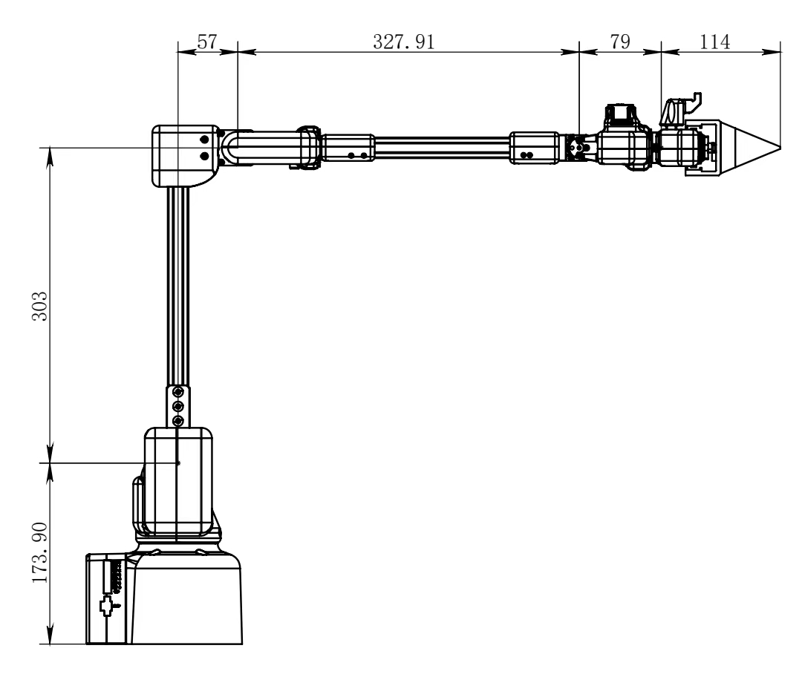{#fig-m750-2d-model-1}
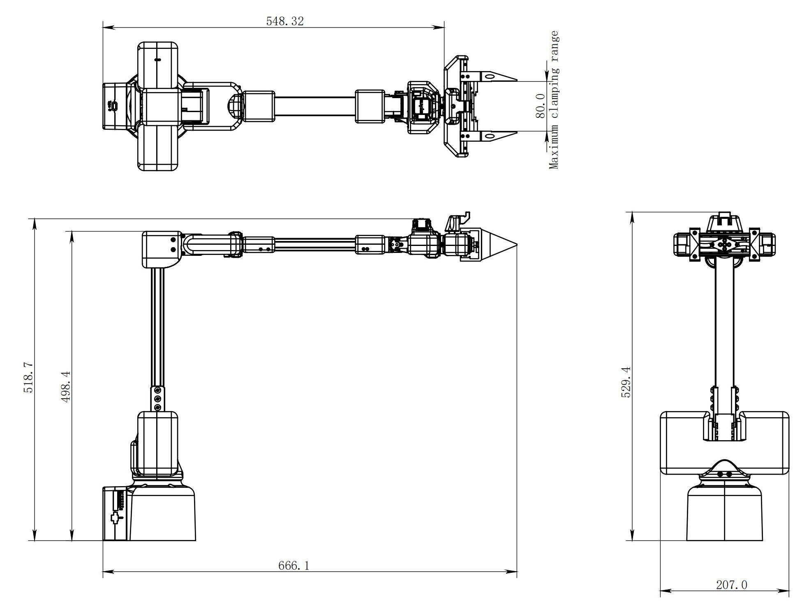{#fig-m750-2d-model-2}
{#fig-m750-3d-model}
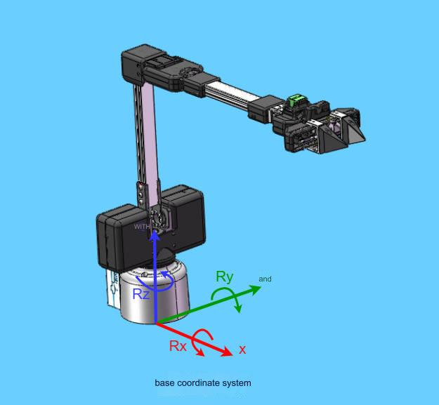{#fig-m750-coordinate-base-frame}
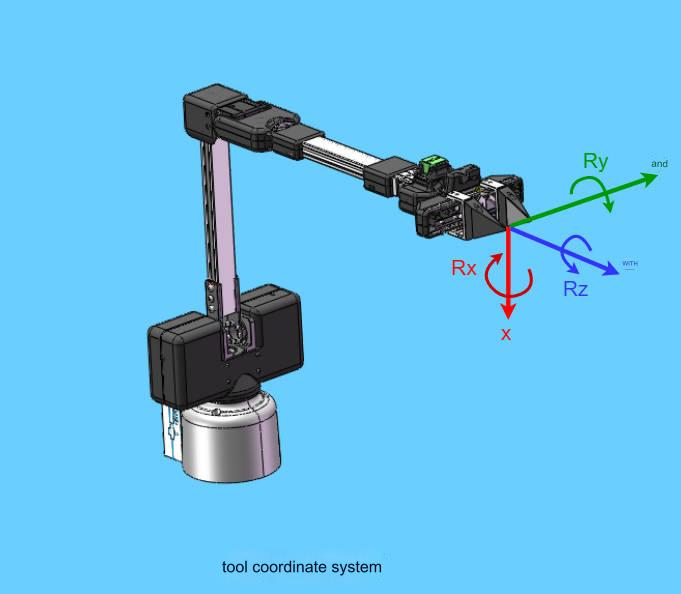{#fig-m750-coordinate-tool-eff-frame}


URDF/Xacro dùng `xyz` theo m, `rpy` theo rad, revolute `limit lower/upper` theo rad, prismatic `limit lower/upper` theo m.

| Joint URDF | Type | Miền giá trị | Ghi chú đơn vị |
| --- | --- | --- | --- |
| joint1 | revolute | $[-3.037, 2.915]~\mathrm{rad}$<br>$[-173.996, 167]~^\circ$ | URDF và JointState dùng rad. |
| joint2 | revolute | $[-1.606, 1.623]~\mathrm{rad}$<br>$[-92, 93.003]~^\circ$ | URDF và JointState dùng rad. |
| joint3 | revolute | $[-1.440, 1.650]~\mathrm{rad}$<br>$[-82.512, 94.549]~^\circ$ | URDF và JointState dùng rad. |
| joint4 | revolute | $[-2.967, 2.967]~\mathrm{rad}$<br>$[-170.002, 170.002]~^\circ$ | URDF và JointState dùng rad. |
| joint5 | revolute | $[-1.675, 1.553]~\mathrm{rad}$<br>$[-95.999, 88.998]~^\circ$ | URDF và JointState dùng rad. |
| joint6 | revolute | $[-2.967, 2.967]~\mathrm{rad}$<br>$[-170.002, 170.002]~^\circ$ | URDF và JointState dùng rad. |
| gripper | prismatic | $[0.000, 0.035]~\mathrm{m}$<br>$[0.0, 34.5]~\mathrm{mm}$ | URDF dùng m; tương ứng 34.5 mm. |
| gripper_r | prismatic | $[0.000, 0.060]~\mathrm{m}$<br>$[0.0, 60.0]~\mathrm{mm}$ | URDF dùng m; tương ứng 60.0 mm. |

_Dữ liệu nguồn: `assets/tables/ros2_urdf_joint_limits_normalized.csv`._

Điểm kỹ thuật nổi bật: URDF `gripper` và `gripper_r` là prismatic, trong khi Python SDK/docs lại có các bảng nói tới joint/servo 7 và servo 8 theo raw encoder/potential. Không có ánh xạ một-một hiển nhiên giữa $q_7[^\circ]$ trong firmware table và displacement `gripper`/`gripper_r` trong URDF.

## 7. Đối chiếu joint limits

| Joint | Docs Shake trước 13/06/2025 | Docs Shake sau 13/06/2025 | Docs Coordinate | SDK `MyArmM` | SDK `MyArmMControl` | ROS2 URDF/Xacro |
| --- | --- | --- | --- | --- | --- | --- |
| $q_1$ | $[-2.967, 2.967]~\mathrm{rad}$<br>$[-170, 170]~^\circ$ | $[-2.880, 2.880]~\mathrm{rad}$<br>$[-165, 165]~^\circ$ | $[-2.880, 2.880]~\mathrm{rad}$<br>$[-165, 165]~^\circ$ | $[-2.880, 2.880]~\mathrm{rad}$<br>$[-165, 165]~^\circ$ | $[-2.880, 2.880]~\mathrm{rad}$<br>$[-165, 165]~^\circ$ | $[-3.037, 2.915]~\mathrm{rad}$<br>$[-173.996, 167]~^\circ$ |
| $q_2$ | $[-1.449, 1.449]~\mathrm{rad}$<br>$[-83, 83]~^\circ$ | $[-1.396, 1.745]~\mathrm{rad}$<br>$[-80, 100]~^\circ$ | $[-1.396, 1.745]~\mathrm{rad}$<br>$[-80, 100]~^\circ$ | $[-1.047, 1.658]~\mathrm{rad}$<br>$[-60, 95]~^\circ$ | $[-1.396, 1.745]~\mathrm{rad}$<br>$[-80, 100]~^\circ$ | $[-1.606, 1.623]~\mathrm{rad}$<br>$[-92, 93.003]~^\circ$ |
| $q_3$ | $[-1.571, 1.466]~\mathrm{rad}$<br>$[-90, 84]~^\circ$ | $[-1.745, 1.396]~\mathrm{rad}$<br>$[-100, 80]~^\circ$ | $[-1.745, 1.396]~\mathrm{rad}$<br>$[-100, 80]~^\circ$ | $[-1.571, 1.309]~\mathrm{rad}$<br>$[-90, 75]~^\circ$ | $[-1.745, 1.396]~\mathrm{rad}$<br>$[-100, 80]~^\circ$ | $[-1.440, 1.650]~\mathrm{rad}$<br>$[-82.512, 94.549]~^\circ$ |
| $q_4$ | $[-2.705, 2.670]~\mathrm{rad}$<br>$[-155, 153]~^\circ$ | $[-2.793, 2.793]~\mathrm{rad}$<br>$[-160, 160]~^\circ$ | $[-2.793, 2.793]~\mathrm{rad}$<br>$[-160, 160]~^\circ$ | $[-2.618, 2.618]~\mathrm{rad}$<br>$[-150, 150]~^\circ$ | $[-2.793, 2.793]~\mathrm{rad}$<br>$[-160, 160]~^\circ$ | $[-2.967, 2.967]~\mathrm{rad}$<br>$[-170.002, 170.002]~^\circ$ |
| $q_5$ | $[-1.588, 1.536]~\mathrm{rad}$<br>$[-91, 88]~^\circ$ | $[-1.571, 2.094]~\mathrm{rad}$<br>$[-90, 120]~^\circ$ | $[-1.571, 2.094]~\mathrm{rad}$<br>$[-90, 120]~^\circ$ | $[-1.588, 1.536]~\mathrm{rad}$<br>$[-91, 88]~^\circ$ | $[-1.571, 2.094]~\mathrm{rad}$<br>$[-90, 120]~^\circ$ | $[-1.675, 1.553]~\mathrm{rad}$<br>$[-95.999, 88.998]~^\circ$ |
| $q_6$ | $[-2.670, 2.670]~\mathrm{rad}$<br>$[-153, 153]~^\circ$ | $[-3.142, 3.142]~\mathrm{rad}$<br>$[-180, 180]~^\circ$ | $[-3.142, 3.142]~\mathrm{rad}$<br>$[-180, 180]~^\circ$ | $[-2.618, 2.618]~\mathrm{rad}$<br>$[-150, 150]~^\circ$ | $[-3.142, 3.142]~\mathrm{rad}$<br>$[-180, 180]~^\circ$ | $[-2.967, 2.967]~\mathrm{rad}$<br>$[-170.002, 170.002]~^\circ$ |
| $q_7$ / gripper | $[-2.059, 0.035]~\mathrm{rad}$<br>$[-118, 2]~^\circ$ | $[-2.059, 0.035]~\mathrm{rad}$<br>$[-118, 2]~^\circ$ | không liệt kê | $[-2.059, 0.035]~\mathrm{rad}$<br>$[-118, 2]~^\circ$ | $[-2.059, 0.035]~\mathrm{rad}$<br>$[-118, 2]~^\circ$ | URDF: prismatic gripper<br>không phải góc $q_7$ |

_Dữ liệu nguồn: `assets/tables/joint_limit_crosscheck_normalized.csv`._

::: callout-warning
Hiện tại đang có nhiều số liệu và thống số không đòng nhất với nhau
- `MyArmM` trong SDK giữ limit hẹp hơn docs Shake mới ở $q_2$ đến $q_6$.
- `MyArmMControl` khớp docs Coordinate ở $q_1$ đến $q_6$, nhưng `robot_info.py` vẫn chứa giá trị thứ 7 trong `angles_min/max` dù `joint_id` của `MyArmMControl` chỉ liệt kê 6 joint.
- URDF/Xacro có miền riêng, ví dụ joint6 là $[-2.967,2.967]~\mathrm{rad}$ / $[-170,170]~^\circ$, trong khi docs Coordinate là $[-3.142,3.142]~\mathrm{rad}$ / $[-180,180]~^\circ$.
:::

## 8. Đối chiếu encoder/potential limits

Encoder/potential là raw count.

| Servo | Docs Shake trước 13/06/2025 | Docs Shake sau 13/06/2025 | SDK `MyArmM` | SDK `MyArmMControl` |
|---|---:|---:|---:|---:|
| S1 | $[114,3981]$ | $[175,3910]$ | $[114,3981]$ | $[137,4004]$ |
| S2 | $[1200,2991]$ | $[1370,3120]$ | $[1200,2991]$ | $[1163,2945]$ |
| S3 | $[1200,2991]$ | $[1370,3120]$ | $[1200,2991]$ | $[1035,3079]$ |
| S4 | $[1024,3002]$ | $[1015,2890]$ | $[1024,3002]$ | $[1013,3026]$ |
| S5 | $[286,3788]$ | $[350,3740]$ | $[286,3788]$ | $[248,3724]$ |
| S6 | $[1013,3048]$ | $[1013,3048]$ | $[1013,3048]$ | $[979,2994]$ |
| S7 | $[307,3788]$ | $[350,3740]$ | $[307,3788]$ | $[220,3704]$ |
| S8 | $[706,2068]$ | $[706,2068]$ | $[706,2068]$ | $[706,2048]$ |

_Dữ liệu nguồn: `assets/tables/encoder_limit_crosscheck.csv`._

Hiện trạng đáng chú ý: `MyArmM` SDK trùng với bảng Shake trước 13/06/2025, không trùng bảng Shake mới; `MyArmMControl` có bộ encoder/potential riêng và không trùng hoàn toàn với cả hai bảng Shake docs.

## 9. Tổng hợp trạng thái của hiện tại

- Docs có spec cơ khí/điện/MDH/joint limits/encoder limits, nhưng không cung cấp đầy đủ phương pháp đo accuracy/repeatability hoặc payload curve.
- Python SDK có bảng validation riêng trong `robot_info.py`, và bảng này không đồng nhất giữa `MyArmM` và `MyArmMControl`.
- ROS2 URDF/Xacro dùng rad/m và có joint limits khác docs/SDK.
- MDH docs và URDF không thể xem là tương đương nếu chưa chứng minh bằng FK tại cùng $q$.
- Encoder/potential raw count không thể tự động diễn giải thành góc nếu thiếu calibration map.


{#fig-m750-atom-down}
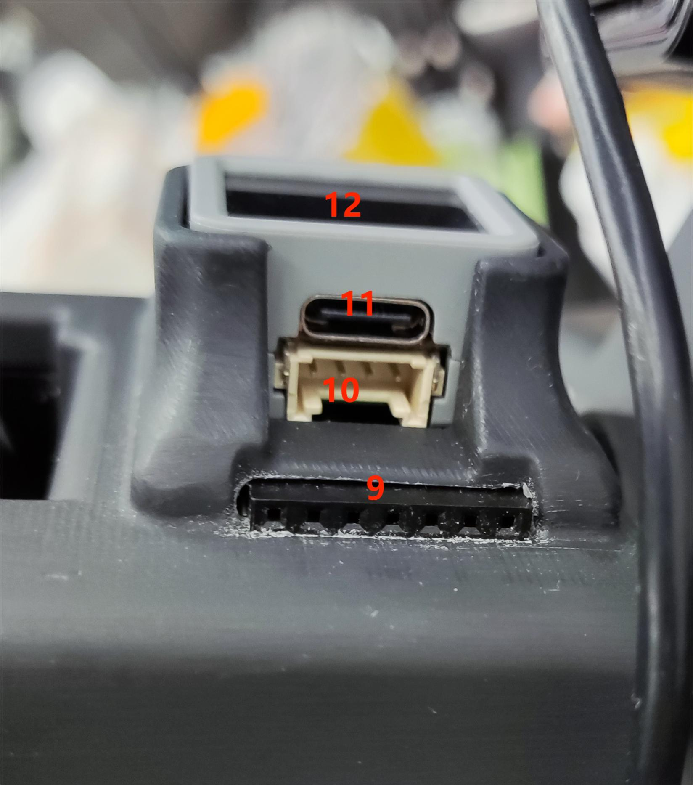{#fig-m750-atom-top}
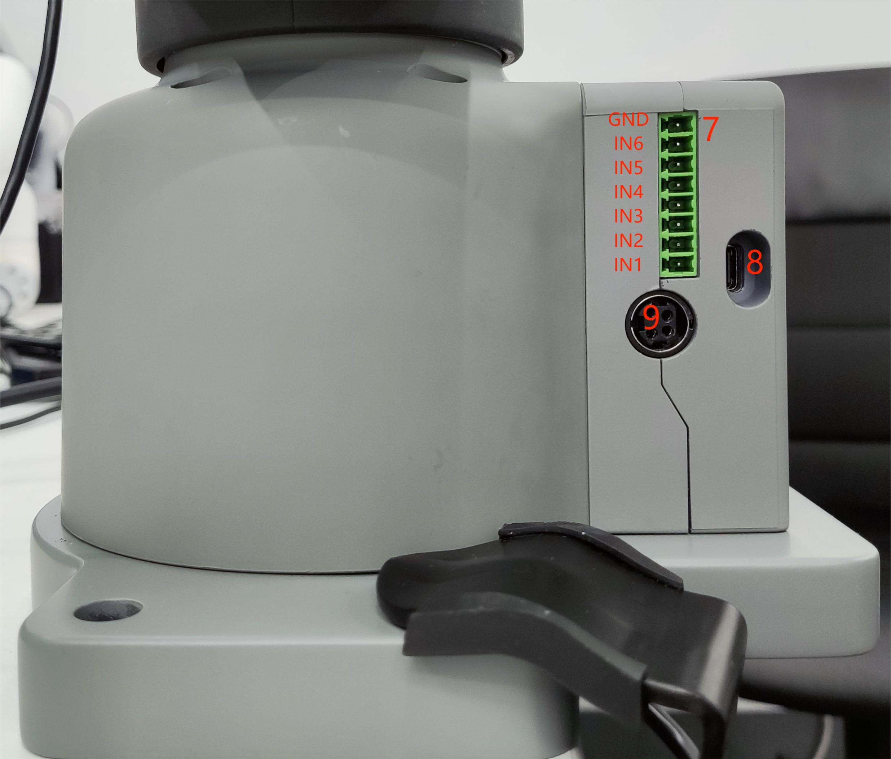{#fig-m750-base-left}
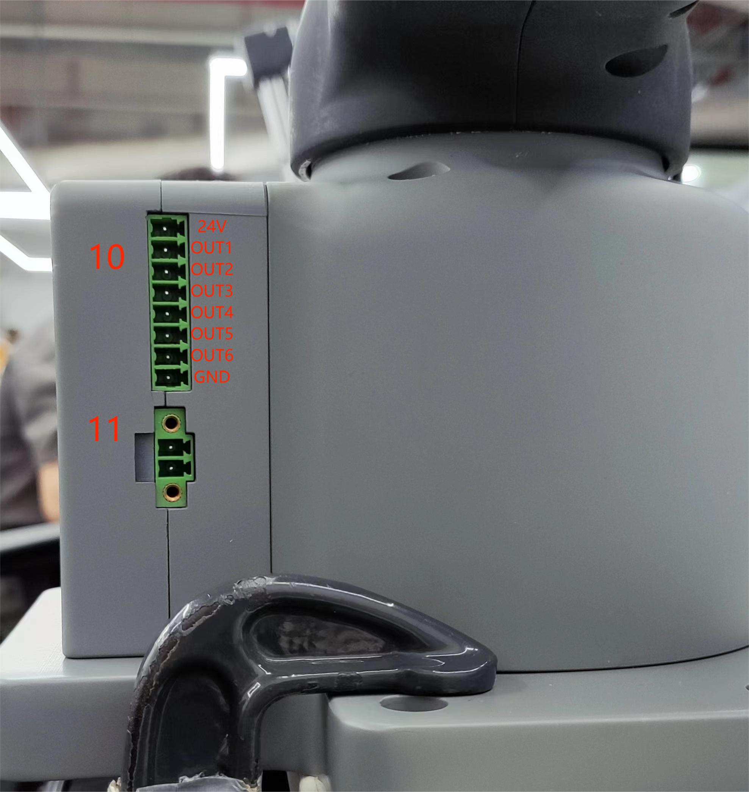{#fig-m750-base-right}
{#fig-m750-base-spec}
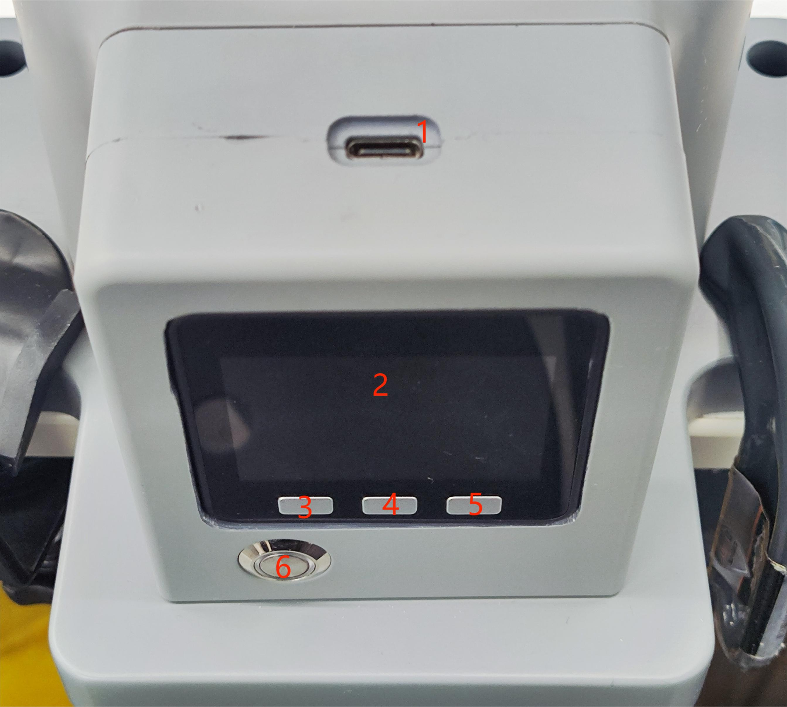{#fig-m750-base-top}

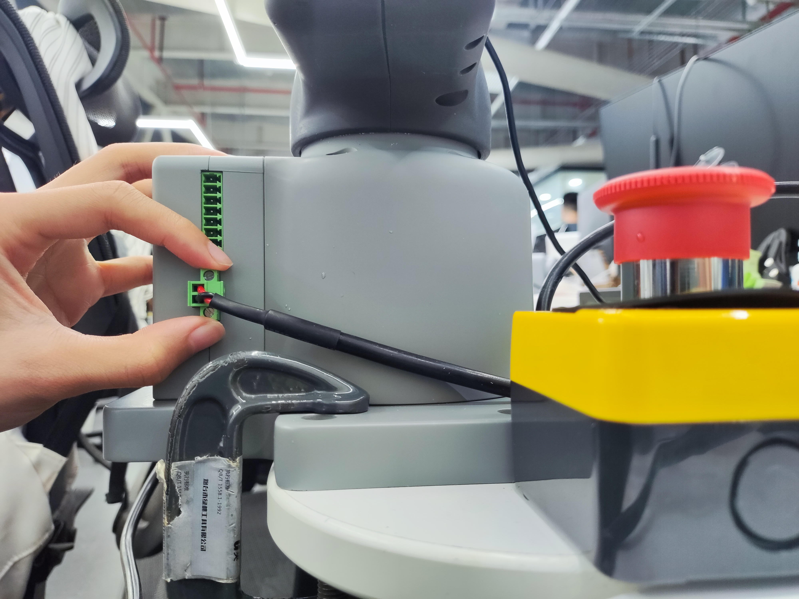{#fig-m750-emergency-stop-connect}

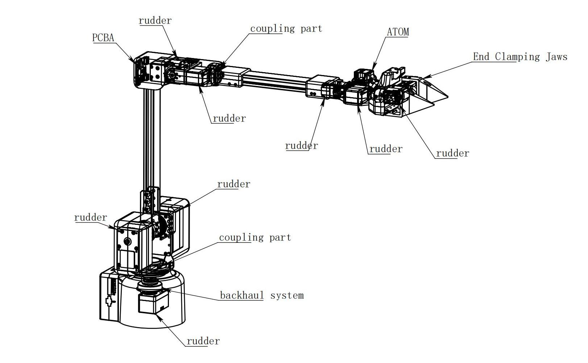{#fig-m750-part-label-name-en}
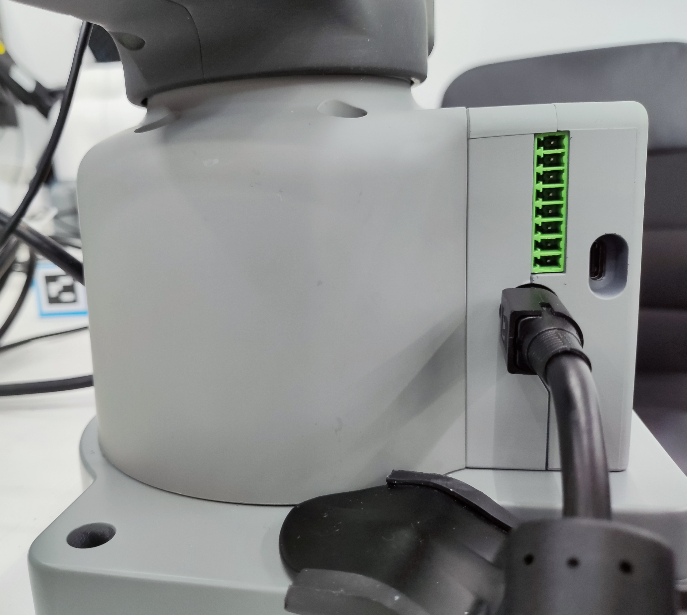{#fig-m750-power-supply-connect}

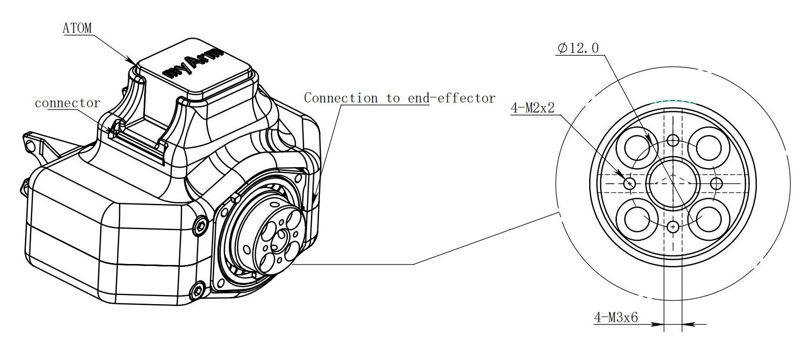{#fig-m750-wrist-spec-en}
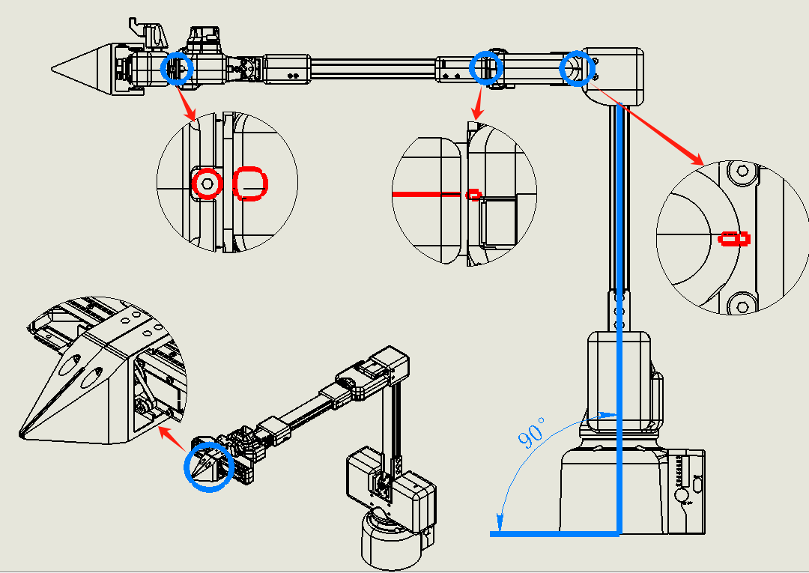{#fig-m750-zero-calib-1}
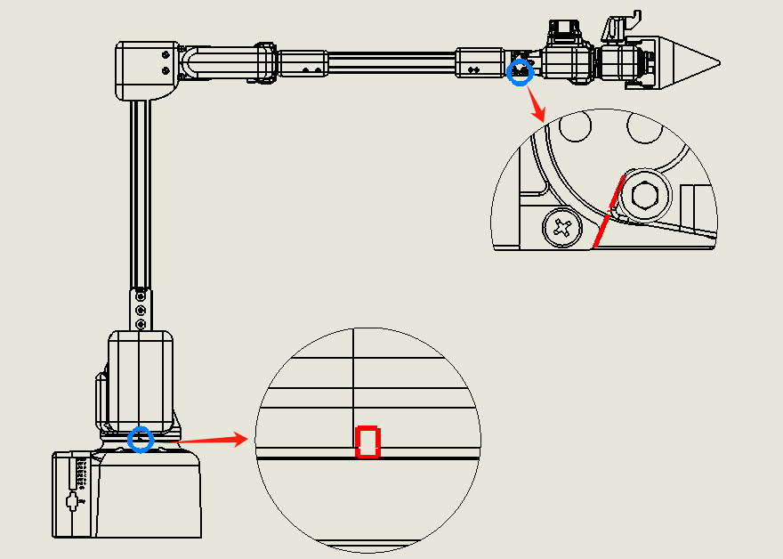{#fig-m750-zero-calib-2}   

## Phụ lục v0.0.6: đọc URDF/Xacro như một mô hình động học riêng

Bản v0.0.6 bổ sung bảng phân tích URDF chi tiết ở `../elephant-robotics-myarm-master-750-analysis-ros2-sdk-specification/index.qmd`. Điểm quan trọng nhất là URDF không phải bảng MDH; mỗi joint URDF có dạng:

$$
{}^{P_i}T_{C_i}(q_i)=T(x_i,y_i,z_i)R_{rpy}(r_i,p_i,y_i)R_z(q_i)
$$ {#eq-hw-urdf-joint-transform-v006}

trong khi MDH docs dùng:

$$
{}^{i-1}T_i(q_i)=R_x(\alpha_{i-1})T_x(a_{i-1})R_z(q_i+\Delta_i)T_z(d_i)
$$ {#eq-hw-mdh-transform-v006}

Vì vậy việc đối chiếu cần dùng FK chain hoặc tool kiểm chứng transform, không chỉ so từng số `origin xyz/rpy` với từng hàng MDH. Bảng joint URDF được xuất ra tại `assets/tables/ros2_urdf_joint_model_v006.csv` để giữ dấu vết source-level.
