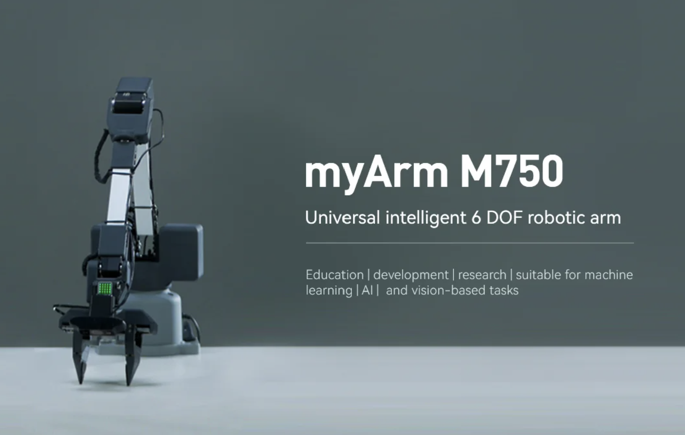
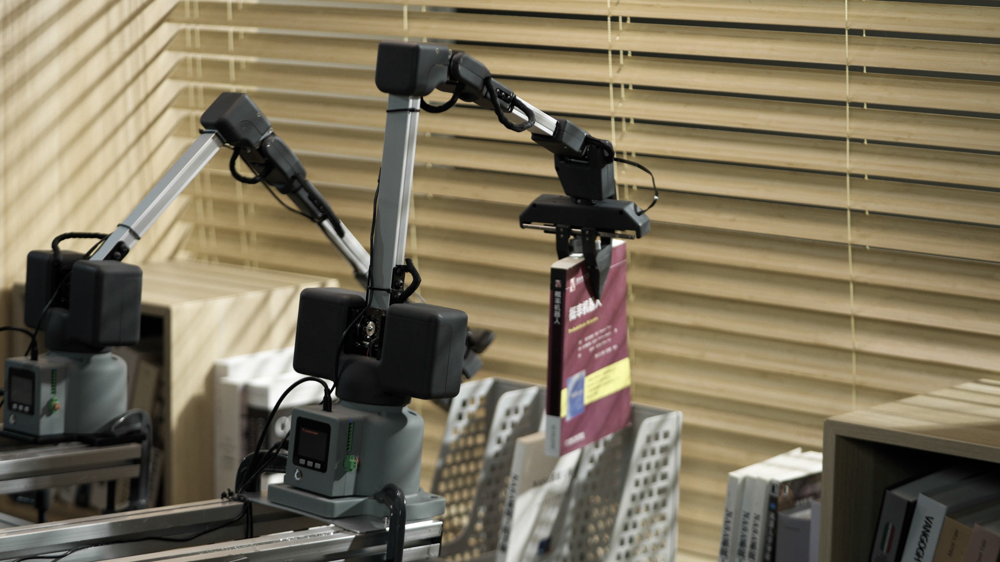
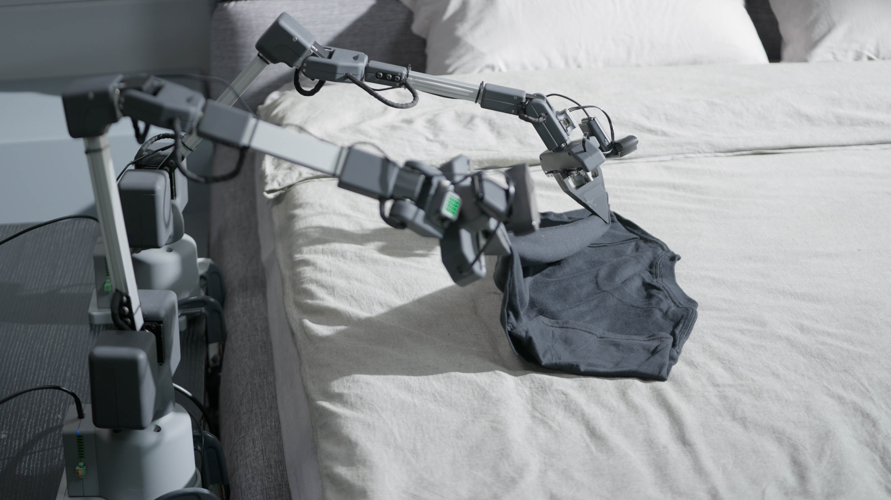

{#fig-m750-product}
{#fig-m750-application-1}
{#fig-m750-application-2}

## Nguồn dữ liệu và mã nguồn

| source_file | role | evidence |
| --- | --- | --- |
| myarm_m750_docs_en/.../2-ProductParameters.md | Spec phần cứng, MDH, joint limits, encoder/potential limits, I/O, frame docs | Machine parameters lines 14-24; units line 94; MDH lines 275-303; limits lines 305-374 |
 myarm_m750_docs_en/.../6.1-BasedOnPythonDevelopmentAndUse/2_API.md | API docs cho Shake và Coordinate firmware | Tài liệu API chính thức trong docs zip, đối chiếu với source pymycobot |
| pymycobot/pymycobot | Source Python SDK đang phân tích | git tag v4.0.4, commit 44d7fb1, __version__=4.0.4 |
 pymycobot/pymycobot/myarmm.py | Class MyArmM cho Shake/joint-servo API | __init__ line 9 baudrate=1000000; set_joints_angle lines 23-32 |
| pymycobot/pymycobot/myarmm_control.py | Class MyArmMControl cho Coordinate API | __init__ line 176 baudrate=115200 default; _mesg line 71 forces has_reply=True; write_coords lines 294-311 |
| pymycobot/pymycobot/robot_info.py | Bảng limit được SDK dùng để validate tham số | MyArmM lines 440-447; MyArmMControl lines 448-457 |
| myarm_ros2/myArm/myarm_m750 | ROS2 demo package cho M750 | read_control.py, slider_control.py, simple_gui.py, teleop_keyboard.py, launch files |
| myarm_ros2/mycobot_description/urdf/myarm_m750/myarm_m750.urdf.xacro | URDF/Xacro model và joint limits của demo ROS2 | joint1-joint6 limits lines 146-190; gripper lines 197-210 |
| Thông tin người dùng cung cấp trong phiên này | Hiện trạng thực nghiệm: coord firmware đã public trên myStudio và đã burn mới nhất vào 3 bộ, baudrate có thể lên 1 Mbps | Observation ngoài source zip; đánh dấu riêng, không trộn thành claim từ docs/source |

_Dữ liệu nguồn: `assets/tables/source_inventory.csv`._

| Source | Nội dung được dùng | Vai trò kỹ thuật |
|---|---|---|
| `2-ProductParameters.md` | spec, I/O, control core, MDH, joint limits, encoder/potential limits | Nguồn docs chính của hardware/kinematics. |
| `pymycobot/robot_info.py` | `robot_limit["MyArmM"]`, `robot_limit["MyArmMControl"]` | Nguồn validation thật trong Python SDK. |
| `myarm_m750.urdf.xacro` | link, joint, `origin xyz/rpy`, `axis`, `limit` | Nguồn ROS2 visualization model. |
| `firmware hiện tại` | coord firmware mới đã public trên myStudio, đã burn vào 3 bộ, baudrate có thể lên 1 Mbps | Observation riêng của dự án, không trộn thành claim từ docs/source zip. |

## Thông tin về  phần cứng, thông số kỹ thuật của cánh tay robot MyArm Master 750 của Elephant Robotics
- thông số kỹ thuật 
  - cơ khí
  - tải
  - độ chính xác repeatablility và accuaracy
  - servo
  - giao tiếp
  - nguồn
  - các công i/o
  - các bộ xử lý mcu phụ trách cho từng phần của cánh tay robot
- Động học 
  - bảng MDH (đối chiếu với Urdf, xacro, mô hình 3d, trong python sdk và ros2)
  - giới hạn các khớp joint limits (đối chiếu trực tiếp với Python SDK và ROS2 SDK, urdf, xacro, mô hình 3d)
  - giá trị encoder (từ trong docs và python SDK, urdf, xacro, mô hình 3d)
  - calib
- Cần cảnh báo về việc đối chiếu và không rõ ràng về thông số kỹ thuật, động học, giới hạn các khớp joint limits, encoder calib,... giữa docs, python sdk, urdf, xacro, mô hình 3d, cũng như là các lỗi, thiếu sót của nhà sản xuất trong việc cung cấp thông tin và tài liệu cho cánh tay robot MyArm Master 750 của Elephant Robotics.

## Thông tin của cánh tay robot MyArm Master 750 bao gồm Python SDK, cũng như firmware.

- các cụm firmware cần nói gồm có pico, basic, atom
  - coordinate firmware
  - shake firmware
  
- Python SDK
    - Kiến trúc tổng quan của Python SDK, các module, lớp, hàm, và cách chúng tương tác với nhau để điều khiển cánh tay robot MyArm Master 750 của Elephant Robotics (tập trung vào myarm m750 thôi)
    - các lớp API:
    - giải thích rõ hơn về cách hoạt động, công dụng, chức năng của từng hàm, agrument, giá trị trả về,... của từng hàm trong từng API firmware (đối chiếu trực tiếp với thư viện pymycobot cũng như là docs)
    - đối chiếu và đính chính các phần trong python sdk có joint limits
    - lớp protocol, serial
    - cảnh báo đối chiếu và không rõ ràng về API và nội dung không thống nhất
- Đính chính lại 1 tí là hiện tại thì firmware coord đã được nhà sản xuất công bố trên app mystudio và tôi đã burn firmware coord mới nhất vào 3 bộ nên baudrate đã có thể truyền lên đến 1Mbps
- Cần có phần cảnh bảo về việc đối chiếu và không rõ ràng về API và nội dung không thống nhất giữa docs, python sdk, urdf, xacro, mô hình 3d, cũng như là các lỗi, thiếu sót của nhà sản xuất trong việc cung cấp thông tin và tài liệu cho cánh tay robot MyArm Master 750 của Elephant Robotics.

## Thông tin của cánh tay robot MyArm Master 750 bao gồm ROS2 SDK.

- tham khảo và phân tích demo ros2 sdk của nhà sản xuất (họ chỉ demo rất đơn giản, lỗi, những thiếu xót của họ)
- phân tích các phần quan trọng đến robot như urdf, xacro (đối chiếu docs, python sdk)
- bổ sung thêm sau này như là các node, topic, service, action, và các công cụ phát triển ROS2 có sẵn, rviz2 simulation gazebo cho cánh tay robot MyArm Master 750 của Elephant Robotics (tự phát triển riêng so với nhà sản xuất)

## Tài liệu và nguồn tham khảo

- [MyArm Master 750 Documentation Github](https://github.com/elephantrobotics/myArm_MC_docs/tree/gitbook-en/myArm_Master_750_docs)
- [MyArm Master 750 Documentation GitBook](https://docs.elephantrobotics.com/docs/myarm-master_750-en/2-ProductInformation/1-ProductIntroduction/1-ProductIntroduction.html)
- [pymycobot Python SDK Github](https://github.com/elephantrobotics/pymycobot/blob/main/docs/myArm_M&C_en.md)
- [ROS2 demo MyArm Master 750 Foxy](https://github.com/elephantrobotics/mycobot_ros2/tree/foxy/myArm/myarm_m750)