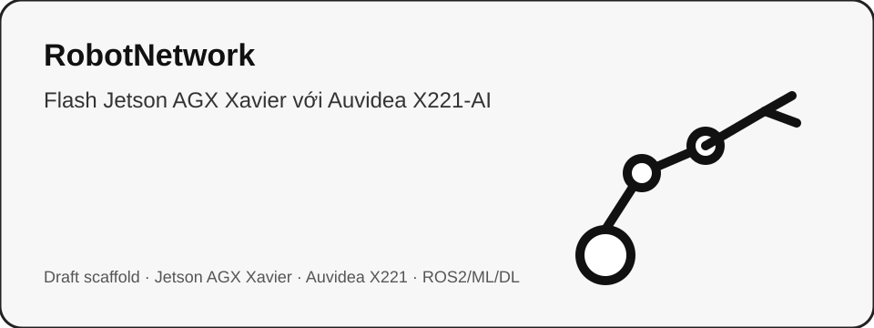

# Phân tích Python SDK và tầng điều khiển reBot B601-DM

::: callout-note
Python SDK là phần đáng học nhất nếu mục tiêu là xây lại tầng điều khiển cho MyArm M750. Nó đưa FK, IK, trajectory và gravity compensation lên software bằng URDF + Pinocchio, thay vì phụ thuộc vào coordinate firmware blackbox.
:::

{#fig-python-sdk-overview width=85%}

## 1. Kiến trúc tổng thể

Luồng runtime của Python SDK có thể mô tả như sau:

```{mermaid}
flowchart LR
    A[config/rebotarm.yaml] --> B[hardware YAML: rebotarm_dm.yaml]
    B --> C[RebotArm]
    C --> D[JointGroup arm]
    C --> E[JointGroup gripper]
    D --> F[motorbridge Controller]
    E --> F
    F --> G[Damiao / RobStride motors]
    B --> H[URDF path]
    H --> I[Pinocchio Robot Model]
    I --> J[FK / IK / Gravity]
    J --> K[RebotArmEndPose]
    K --> D
```

Python SDK có 5 lớp chức năng chính:

| Lớp | Thành phần chính | Vai trò |
|---|---|---|
| Config layer | `rebotarm.yaml`, `rebotarm_dm.yaml` | Chọn model, URDF, channel, rate, motor IDs, gains. |
| Hardware abstraction | `RebotArm`, `JointGroup`, `NoOpGroup` | Gom motor thành group logic, ẩn chi tiết vendor. |
| Kinematics | `robot_model.py`, `forward_kinematics.py`, `inverse_kinematics.py` | Load URDF bằng Pinocchio, FK, numerical IK. |
| Trajectory | `sampler.py`, `clik_tracker.py`, `trajectory_planner.py` | SE(3) interpolation, CLIK tracking, joint trajectory. |
| High-level controller | `RebotArmEndPose` | Pose command, safe home, gravity compensation, loop callback. |

Source map chi tiết nằm tại `assets/tables/python_sdk_source_map.csv`.[^python-source-map]

## 2. Hardware description: YAML + URDF

YAML DM runtime khai báo:

```yaml
name: rebot_arm
urdf_path: urdf/reBot-DevArm_fixend_description/urdf/reBot-DevArm_fixend.urdf
end_effector_frame: end_link
channel: /dev/ttyACM0
rate: 500
```

Cấu hình group:

```yaml
groups:
  arm:
    joints: [joint1, joint2, joint3, joint4, joint5, joint6]
  gripper:
    joints: [gripper]
```

Điều này cho thấy SDK dùng mô hình **config-driven**. Code không hard-code toàn bộ robot trong controller; thay vào đó runtime được cấu hình bằng YAML.[^py-loadcfg]

| joint | motor_id_hex | feedback_id_hex | vendor | model | mit_kp | mit_kd | pos_vel_vlim_rad_s | pos_vel_pos_kp | pos_vel_pos_ki | pos_vel_vel_kp | pos_vel_vel_ki |
| --- | --- | --- | --- | --- | --- | --- | --- | --- | --- | --- | --- |
| joint1 | 0x1 | 0x11 | damiao | 4340P | 120.0 | 8.0 | 5.0 | 150.0 | 0.5 | 0.0125 | 0.004 |
| joint2 | 0x2 | 0x12 | damiao | 4340P | 120.0 | 8.0 | 5.0 | 150.0 | 0.5 | 0.0125 | 0.004 |
| joint3 | 0x3 | 0x13 | damiao | 4340P | 120.0 | 8.0 | 5.0 | 150.0 | 0.5 | 0.0125 | 0.004 |
| joint4 | 0x4 | 0x14 | damiao | 4310 | 18.0 | 2.0 | 3.0 | 50.0 | 1.0 | 0.0008 | 0.002 |
| joint5 | 0x5 | 0x15 | damiao | 4310 | 18.0 | 2.0 | 3.0 | 50.0 | 1.0 | 0.0008 | 0.002 |
| joint6 | 0x6 | 0x16 | damiao | 4310 | 18.0 | 2.0 | 3.0 | 50.0 | 1.0 | 0.0008 | 0.002 |
| gripper | 0x7 | 0x17 | damiao | 4310 | 8.0 | 1.0 | 3.0 | 50.0 | 1.0 | 0.0008 | 0.002 |

### 2.1. Vai trò của URDF

URDF được dùng bởi Pinocchio để build model:

```python
model = pin.buildModelFromUrdf(urdf_path)
```

Sau đó SDK lấy frame id, joint names, joint limits và end-effector frame từ model.[^py-robot-model]

## 3. Hardware abstraction: `RebotArm`, `JointGroup`, `NoOpGroup`

`RebotArm` là container runtime: load YAML, tạo motorbridge controller, tạo motor objects, tạo group, connect/disconnect, enable/disable, read state và start/stop control loop. `_make_controller()` chọn serial bridge nếu channel bắt đầu bằng `/dev/tty`, dùng `Controller.from_dm_serial(channel, 921600)`.[^py-controller-serial]

`JointGroup` gom nhiều motor thành một interface chung:

```python
arm.mode_pos_vel()
arm.send_pos_vel(pos=q_target, vlim=vlim)
arm.mode_mit()
arm.send_mit(pos=q, vel=qd, kp=kp, kd=kd, tau=tau_ff)
```

Nó lưu mảng gain như `_mit_kp`, `_mit_kd`, `_pv_vlim` và cung cấp API feedback như `get_positions()`, `get_velocities()`, `get_torques()`.[^py-jointgroup]

Nếu config không có gripper, `RebotArm` tạo `NoOpGroup`. Đây là pattern tốt: high-level code vẫn gọi cùng interface nhưng không phải viết quá nhiều nhánh `if gripper is None`.[^py-noop]

::: callout-tip
Với MyArm M750, nên copy ý tưởng `JointGroup` và `NoOpGroup`. Application chỉ nên thấy `arm_group`, `gripper_group`, không nên gọi trực tiếp từng motor hoặc từng command firmware.
:::

## 4. Control modes và control loop

| Mode | API | Ý nghĩa | Dùng cho |
|---|---|---|---|
| MIT | `send_mit(pos, vel, kp, kd, tau)` | PD + feedforward torque / impedance-like | Holding, gravity compensation, gripper force-like control |
| POS_VEL | `send_pos_vel(pos, vlim)` | Position target + velocity limit | Move đơn giản, trajectory position mode |
| VEL | `send_vel(vel)` | Velocity command | Debug/low-level velocity |

Trong B601-DM, arm mặc định thường dùng POS_VEL, còn gripper và gravity compensation dùng MIT. Với B601-RS, ROS2 config chuyển arm sang MIT.[^ros-hw-config]

`start_control_loop(control_fn, rate)` tạo daemon thread và gọi callback theo chu kỳ. Với `rate: 500`, chu kỳ lý tưởng là $dt=0.002~\mathrm{s}$.[^py-loop]

::: callout-warning
Trong các hàm `send_mit`, `send_pos_vel`, `send_vel`, SDK catch `CallError` rồi `pass`.[^py-send] Điều này không tốt cho benchmark nghiêm túc vì command drop có thể không được log.
:::

## 5. FK, IK và trajectory

Hàm FK gọi `pin.forwardKinematics()` và `pin.updateFramePlacements()`, trả về:

$$
T =
\begin{bmatrix}
R & p \\
0 & 1
\end{bmatrix},
\quad R \in SO(3),\quad p \in \mathbb{R}^3
$$ {#eq-python-sdk-se3}

IK solver dùng error trong Lie algebra:

$$
e = \log\left(T_{current}^{-1}T_{target}\right) \in \mathbb{R}^6
$$ {#eq-ik-error}

và damped least squares:

$$
\Delta q = \eta J^T\left(JJ^T + \lambda I\right)^{-1} e
$$ {#eq-dls}

Trong code, error được tính bằng `pin.log6(T_cur.inverse() * target).vector`, Jacobian lấy ở local frame, có adaptive damping, clamp joint limit, backtracking line search và retry với seed random.[^py-ik]

Trajectory sampler dùng nội suy trên $SE(3)$:

$$
T(s)=T_0\exp\left(\log(T_0^{-1}T_1)s\right),\quad s\in[0,1]
$$ {#eq-se3-geodesic}

CLIK tracker biến chuỗi pose thành chuỗi joint bằng Jacobian DLS theo từng waypoint.[^py-sampler] [^py-clik]

```{mermaid}
flowchart LR
    A[Target pose] --> B[IK endpoint]
    B --> C[FK start/end]
    C --> D[SE(3) geodesic sampler]
    D --> E[CLIK tracker]
    E --> F[Joint trajectory q(t)]
    F --> G[send_pos_vel or send_mit]
```

Đây là trajectory generator, chưa phải full motion planner: chưa tránh collision, chưa tối ưu manipulability, chưa ràng buộc obstacle.

## 6. High-level `RebotArmEndPose` và gravity compensation

`RebotArmEndPose` expose `start()`, `end()`, `safe_home()`, `move_to_ik(...)`, `move_to_traj(...)`. `move_to_ik()` giải IK một lần rồi set `_q_target`. `move_to_traj()` giải IK target, lấy FK start/end, tạo Cartesian geodesic trajectory, tracking bằng CLIK, rồi stream joint targets ở thread riêng.[^py-endpose]

Trong MIT mode, loop callback có thể tính generalized gravity:

$$
\tau_g(q) = G(q)
$$ {#eq-gravity}

Code dùng Pinocchio `computeGeneralizedGravity` và scale riêng joint2/joint3 khoảng $1.55$ trong `RebotArmEndPose`.[^py-gravity]

::: callout-caution
Nếu copy kiến trúc sang MyArm M750 nhưng hardware không hỗ trợ torque/MIT mode, gravity compensation chỉ có thể dùng gián tiếp để phân tích hoặc feedforward nếu firmware hỗ trợ torque/current. Với position-only firmware, vẫn có thể benchmark holding drift nhưng không thể áp dụng $\tau_g$ trực tiếp.
:::

## 7. Đánh giá và bài học cho MyArm M750

| Tiêu chí | Đánh giá | Ý nghĩa cho MyArm M750 |
|---|---|---|
| Tách FK/IK khỏi firmware | Rất tốt | Đúng hướng thay coordinate firmware blackbox. |
| Config-driven hardware | Tốt | Nên áp dụng bằng YAML riêng cho MyArm. |
| JointGroup abstraction | Tốt | Giảm coupling giữa app và vendor protocol. |
| Pinocchio integration | Tốt | Phù hợp FK/IK/gravity/benchmark. |
| Trajectory layer | Trung bình tốt | Đủ prototype, chưa full collision planning. |
| Error handling | Cần cải thiện | Không nên nuốt lỗi communication trong benchmark. |
| Real-time behavior | Cần benchmark | Python thread không hard real-time. |
| API boundary | Cần sạch hơn | Một số demo/ROS2 chọc private fields. |

Thiết kế MyArm M750 nên có:

```text
MyArmM750PythonSDK
  ├── config/myarm_m750.yaml
  ├── hardware/MyArmTransport
  ├── hardware/JointGroup
  ├── kinematics/PinocchioModel
  ├── kinematics/DLSIKSolver
  ├── trajectory/JointTrajectorySampler
  ├── trajectory/CartesianCLIKTracker
  ├── controller/ArmController
  └── safety/Watchdog + StateMachine
```

## 8. Source evidence

```{python}
#| eval: false
import pandas as pd
pd.read_csv("assets/tables/python_sdk_source_map.csv")
```

[^python-source-map]: `assets/tables/python_sdk_source_map.csv`, tạo từ source zip được upload trong phiên làm việc này.
[^py-loadcfg]: Uploaded source: `reBotArm_control_py/reBotArm_control_py/actuator/rebotarm.py`, lines 69--116.
[^py-robot-model]: Uploaded source: `reBotArm_control_py/reBotArm_control_py/kinematics/robot_model.py`, lines 21--84.
[^py-controller-serial]: Uploaded source: `reBotArm_control_py/reBotArm_control_py/actuator/rebotarm.py`, lines 484--508.
[^py-jointgroup]: Uploaded source: `reBotArm_control_py/reBotArm_control_py/actuator/rebotarm.py`, lines 186--314 and 331--424.
[^py-noop]: Uploaded source: `reBotArm_control_py/reBotArm_control_py/actuator/rebotarm.py`, lines 123--179.
[^ros-hw-config]: Uploaded source: `reBotArmController_ROS2/src/rebotarm_bringup/config/rebotarm_hardware.yaml`, lines 7--59.
[^py-send]: Uploaded source: `reBotArm_control_py/reBotArm_control_py/actuator/rebotarm.py`, lines 331--390.
[^py-loop]: Uploaded source: `reBotArm_control_py/reBotArm_control_py/actuator/rebotarm.py`, lines 705--735.
[^py-ik]: Uploaded source: `reBotArm_control_py/reBotArm_control_py/kinematics/inverse_kinematics.py`, lines 70--186 and 189--280.
[^py-sampler]: Uploaded source: `reBotArm_control_py/reBotArm_control_py/trajectory/sampler.py`, lines 16--118.
[^py-clik]: Uploaded source: `reBotArm_control_py/reBotArm_control_py/trajectory/clik_tracker.py`, lines 17--127.
[^py-endpose]: Uploaded source: `reBotArm_control_py/reBotArm_control_py/controllers/rebotarm_endpose_controller.py`, lines 76--356.
[^py-gravity]: Uploaded source: `reBotArm_control_py/reBotArm_control_py/dynamics/inverse_dynamics.py`, lines 24--131; `controllers/rebotarm_endpose_controller.py`, lines 326--356.
