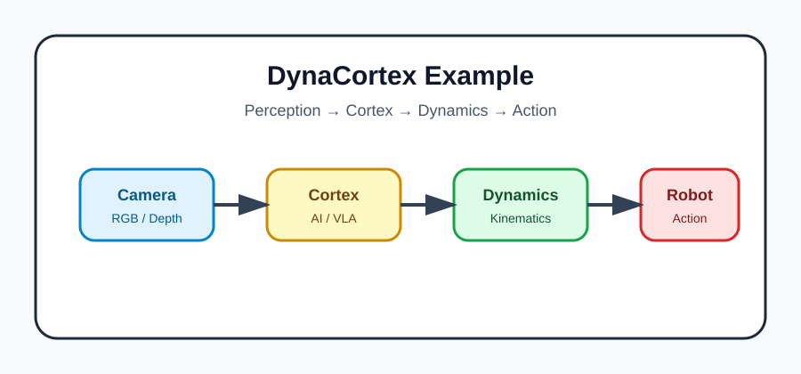

# QMD Syntax Examples

Trang này dùng để kiểm tra nhanh những thành phần thường gặp khi viết tài liệu kỹ thuật bằng `.qmd`.

## 1. Text formatting

Bạn có thể viết **chữ đậm**, *chữ nghiêng*, `inline code`, ~~gạch ngang~~, link nội bộ như [Setup & Deploy](../04-reference/setup-deploy.qmd), và danh sách:

- Robotics
- Embodied AI
- Vision-Language-Action Models
- Simulation-to-real transfer

::: callout-note
Đây là một callout note. Dùng để nhấn mạnh ghi chú quan trọng trong tài liệu.
:::

::: callout-warning
Đây là một callout warning. Dùng cho rủi ro, lỗi dễ gặp hoặc điều cần kiểm tra kỹ.
:::

## 2. Code block

Code block thường dùng để ghi lệnh terminal, config, Python hoặc snippet ROS2.

```bash
quarto preview
ros2 topic list
ros2 node list
```

```python
import numpy as np

T_base_cam = np.eye(4)
p_cam = np.array([0.1, 0.0, 0.5, 1.0])
p_base = T_base_cam @ p_cam
print(p_base)
```

## 3. Công thức toán học và ký hiệu toán học inline hoặc block equation. Quarto hỗ trợ MathJax, KaTeX, LaTeX, và các ký hiệu toán học phổ biến.

Inline math: điểm 3D trong hệ camera có thể viết là $e = m^c$ hoặc dưới dạng vector cột: 


Block equation:

$$
T =
\begin{bmatrix}
R & t \\
0 & 1
\end{bmatrix},
\quad R \in SO(3), \quad t \in \mathbb{R}^3
$$ {#eq-se3-transform}

Tham chiếu phương trình: xem @eq-se3-transform.

## 4. Mermaid diagram

```{mermaid}
flowchart LR
    A[Camera Capture] --> B[Calibration]
    B --> C[TSDF / 3D Reconstruction]
    C --> D[Grasp Prediction]
    D --> E[Robot Runtime]
    E --> F[Execution Log]
```

## 5. Hình ảnh

{#fig-example-robot width=70%}

Tham chiếu hình: xem @fig-example-robot.

## 6. Bảng Markdown

| Thành phần | Vai trò | Ghi chú |
|---|---|---|
| Jetson | Edge runtime | Camera, inference, robot runtime |
| Laptop/PC | Visualization & development | RViz2, Gazebo, debugging |
| Ethernet | DDS transport | Ổn định hơn Wi-Fi trong nhiều tình huống |
| Quarto | Documentation engine | Render `.qmd` sang HTML/PDF |

## 7. Bảng từ CSV bằng Python

Bảng nhỏ có thể viết trực tiếp bằng Markdown. Bảng kết quả thí nghiệm nên lưu CSV và render bằng code cell.

```{python}
#| eval: false
# Ví dụ tuỳ chọn: nếu đã cài Python + Jupyter + pandas, có thể bật eval để render CSV.
import pandas as pd

pd.read_csv("assets/tables/example-calibration.csv")
```

Hoặc viết bảng trực tiếp bằng Markdown như ví dụ ở trên để website build nhẹ và ổn định hơn.

## 8. Citation

Ví dụ citation: Octo là một generalist robot policy mã nguồn mở [@octo2024], còn RT-1 là một Robotics Transformer cho real-world control [@rt12023].

## 9. Checklist

- [x] Code block
- [x] Mermaid diagram
- [x] Math equation
- [x] Figure
- [x] Markdown table
- [x] CSV table
- [x] Citation
